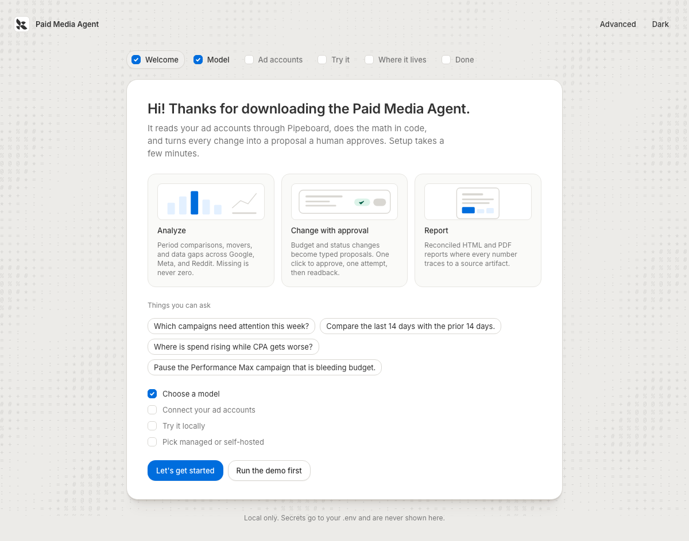

# Paid Media Agent

Paid Media Agent is an open-source Deep Agents application for analyzing and safely managing paid
platforms through Pipeboard. One shared agent core powers local development, Managed Deep Agents
(MDA), self-hosted deployments, Slack, and an Agent UI.

A developer should be able to:

- clone the repository and run a useful fixture-backed demo without connecting an ad account;
- choose any supported tool-calling model directly, without a LangSmith Gateway;
- connect Google Ads, Meta Ads, Reddit Ads, and other supported platforms through Pipeboard;
- ask business questions across campaigns, audiences, creatives, spend, conversions, and pipeline;
- generate reconciled reports from deterministic calculations;
- review an exact proposed change before any provider mutation runs;
- deploy the simple Slack experience through MDA or use the rich Slack adapter locally and in a
  self-hosted environment;
- use the same threads, proposals, reports, and receipts from an Agent UI.

## Architecture

The model investigates, chooses evidence, and explains results. Trusted code owns tool authorization,
account identity, arithmetic, validation, reconciliation, approval state, provider mutation, readback,
and report layout.

```text
Slack / Agent UI / API / schedule
              |
       shared agent assembly
              |
  skills + business wiki + middleware
              |
 authorized Pipeboard catalog + deterministic tools
              |
 proposal -> approval -> one mutation -> readback -> receipt
```

Provider-native deferred tool search is used only when the selected OpenAI or Anthropic model supports
it. Other models use `LLMToolSelectorMiddleware`. Both paths finish by resolving the selected name and
schema against the same host-owned authorized catalog.

## Runtime profiles

| Profile | Best for | What it provides |
|---|---|---|
| Local | development and demos | fixture data, local filesystem, local graph, optional Slack Socket Mode |
| MDA | fastest managed deployment | managed threads, checkpoints, sandbox, schedules, observability, and native Slack |
| Self-hosted | full infrastructure and UX control | Postgres-backed state, rich Slack, custom auth, custom API, and optional Agent UI |

The profiles share business logic and tool policy. A surface adapter may render differently, but it
cannot grant a capability or bypass an approval.

Independently of the profile, `PAID_MEDIA_BACKEND=sandbox` moves the model's filesystem into a
LangSmith sandbox built from `sandbox/Dockerfile`, with the same paths as the repository, so local
runs use the same world as production. See [sandbox/README.md](sandbox/README.md).

## Quick start

Needs Python 3.11 or newer and [uv](https://docs.astral.sh/uv/). No ad account or model key is
required for the first command.

```bash
uv sync --all-extras --dev
uv run paid-media-agent demo --with-proposal   # fixture data through the real graph, including an approval
uv run paid-media-agent setup                  # local page: model, ad accounts, try it, where it lives
```

`setup` opens a local-only onboarding page (127.0.0.1, per-run token, writes only your `.env`):
pick a model provider and test one call, paste a scoped Pipeboard token and tick the accounts the
agent may read, ask a question or open LangGraph Studio, then choose Managed Deep Agents or
self-hosting. Every step shows the CLI command it runs, so a coding agent can do the same without
a browser. The full command reference is in [OPERATIONS.md](OPERATIONS.md#command-reference).

```bash
uv run paid-media-agent doctor --json           # every check, machine-readable
uv run paid-media-agent ask "How did spend move week over week?"
uv run paid-media-agent report --cadence weekly # deterministic HTML and PDF report
uv run langgraph dev                            # LangGraph Server and Studio (studio extra)
uv run paid-media-agent serve                   # self-hosted API, plus signed Slack HTTP when configured
uv run paid-media-agent mda dev                 # managed run, same graph
```



## Platform coverage

| Platform | Path | Reads | Writes |
|---|---|---|---|
| Google Ads, Meta Ads, Reddit Ads | Pipeboard Streamable HTTP MCP | live catalog, classified by MCP annotations | admitted rows only, behind the write gates |
| LinkedIn Ads | direct adapter (`tools/direct/linkedin.py`), OAuth 2.0 bearer with refresh | accounts, campaigns, daily campaign analytics | none in v1 |
| X Ads | direct adapter (`tools/direct/x_ads.py`), OAuth 1.0a signed | accounts, campaigns, daily campaign stats | none in v1 |
| OpenAI Ads | direct adapter (`tools/direct/openai_ads.py`), bearer key | account, campaigns, daily insights | none in v1 |

Direct platforms join the same authorized catalog as Pipeboard tools whenever their credentials
are configured, so alias scope, schema validation, artifact offload, and `compare_periods` work the
same way across all six.

## Models and the LangSmith Gateway

`PAID_MEDIA_MODEL` takes `provider:model`. The recommended path for teams already on LangSmith is
the LLM Gateway: `PAID_MEDIA_MODEL=langsmith:anthropic/claude-sonnet-4-6` with `LANGSMITH_API_KEY`,
which gives one key for every provider and a trace for every call. Gateway models use the portable
tool selector; direct Anthropic and OpenAI keys unlock provider-native tool search.

## Reports

`uv run paid-media-agent report --cadence weekly` (or `monthly`) reads every alias, compares the
last complete window with the one before, and renders HTML and PDF with no model in the loop. The
MDA project ships the same runs as schedules in `schedules/`. A platform whose read fails stays
visible as unavailable and suppresses the cross-platform total.

## Managed Deep Agents path

`agent.py` exports the definition MDA needs; `instructions.md`, `skills/`, `channels/slack.py`,
`identity.py` (the LangSmith identity Slack ingress requires), `schedules/` (weekly and monthly
reports), and the generated `sandbox/__init__.py` (written by `paid-media-agent sandbox publish|use`)
are the managed project files. With a LangSmith API key in `.env`:

```bash
uv run mda dev        # local managed run with LangSmith Studio
uv run mda deploy .   # hosted deployment; provisions native Slack from channels/slack.py
```

The managed build installs core dependencies only, so the Anthropic and OpenAI integration
packages (the latter also serves `langsmith:` gateway models) ship in core; other providers stay
optional extras and are unavailable in a managed build unless you move them into core.
`mda deploy` needs a LangSmith key with deployment permissions; a key that can only trace or
call the gateway fails with `403 deployments:read`.

Native Slack supports approve and reject on `execute_change`. Use the rich adapter
(`paid-media-agent slack`) when reviewers need edits, receipts, and files in Block Kit.

## Start here

- [Architecture](docs/architecture/README.md) and [operations](OPERATIONS.md)
- [Paid-media business context](docs/business-context/README.md) the agent reads at run time
- [Operating contract for humans and coding agents](AGENTS.md)
- [Contributing](CONTRIBUTING.md), [security policy](SECURITY.md), [changelog](CHANGELOG.md)

Release gates (license text, naming, security contact) are tracked in
[open-questions.md](open-questions.md). The repository must never contain customer data,
account identifiers, private thresholds, credentials, or copied proprietary material.
