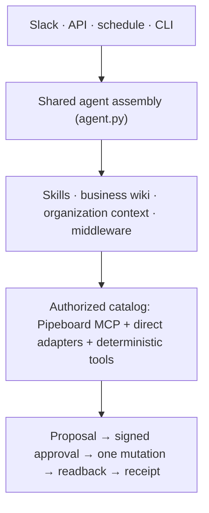

<div align="center">
  <a href="https://github.com/langchain-ai/open-paid-media-agent">
    <h1>Paid Media Agent</h1>
  </a>
</div>

<div align="center">
  <h3>Ask questions across your ad accounts. Approve every change before it happens.</h3>
</div>

<div align="center">
  <a href="LICENSE" target="_blank"></a>
  <a href="https://github.com/langchain-ai/deepagents" target="_blank"></a>
  <a href="https://github.com/langchain-ai/langgraph" target="_blank"></a>
  <a href="https://docs.langchain.com/langsmith/python/managed-deep-agents" target="_blank"></a>
</div>

<br>

Paid media is hard to run across platforms. Each one reports in its own schema, so spend and
conversions do not add up across channels. Every change happens in a vendor console with no
record of who decided it or why.

Paid Media Agent is a [Deep Agent](https://docs.langchain.com/oss/python/deepagents/overview) for
that job. It reads Google, Meta, Reddit, LinkedIn, X, and OpenAI Ads, computes the numbers in
code, and turns every change into a proposal a person approves. Deploy it to Slack in one
command, or self-host it.

> [!NOTE]
> Under active development. Live provider writes stay behind release gates until a separately
> authorized canary; everything else runs today.

<div align="center">
  <picture>
    <source media="(prefers-color-scheme: dark)" srcset="docs/screenshots/setup-welcome-dark.png">
    
  </picture>
</div>

## Quick start

No ad account or model key needed for the first two commands. Python 3.11+ and [uv](https://docs.astral.sh/uv/).

```bash
uv sync --all-extras --dev
uv run paid-media-agent demo --with-proposal   # synthetic accounts through the real agent, with one approved change
uv run paid-media-agent setup                  # the setup console
```

The demo compares two weeks against the prior two, proposes a budget change, approves it,
executes it against a fake provider, reads the value back, and prints the receipt.

## What it does

| | The model | Code |
|---|---|---|
| **Analyze** | Picks the window and the accounts, explains what moved | Compares periods in `Decimal`; keeps missing metrics missing; no cross-platform total when sources disagree |
| **Change** | Proposes a typed change with a reason and a reversal plan | Stores the proposal, requires a signed single-use approval, makes one mutation attempt, reads back, returns a receipt: verified, failed, or unknown |
| **Report** | Writes the summary | Renders HTML and PDF where every number reconciles to a source artifact; runs weekly and monthly on a schedule |

The model decides, the code calculates.

## Where it runs

| | Managed Deep Agents, recommended | Self-host |
|---|---|---|
| Deploy | `uv run mda deploy .` | `docker compose up` |
| Provides | Slack, schedules, threads, a sandbox per thread, identity | Your API, Postgres, and a Slack app you own |
| Setup | One LangSmith key | A Slack app, a database URL, API tokens |
| Locally | `uv run mda dev` | `uv run paid-media-agent serve` and `slack` |
| Guide | [Operations](OPERATIONS.md#deploying-with-managed-deep-agents) | [Self-hosting](docs/self-hosting.md) |

Same agent either way. A surface changes how a result looks, not what the agent may do.

```bash
uv run paid-media-agent ask "How did spend move week over week?"
uv run paid-media-agent report --cadence weekly
```

## What code guarantees

- **Deny by default.** Provider tools enter through a catalog built in host code. No read-only annotation or reviewed policy row, no tool.
- **Host-owned identity.** The model sees account aliases, never provider ids or credentials. Approvers are an allowlist the host checks.
- **One attempt.** A live write needs the kill switch clear, the flag on, the catalog revision pinned, and the tool on the canary list. Uncertain outcomes are reported as unknown, never retried.
- **Nothing phones home.** The agent talks only to the providers you configure.

## Platforms

| Platform | Path | Reads | Writes |
|---|---|---|---|
| Google, Meta, Reddit | [Pipeboard](https://pipeboard.co) MCP | live catalog, classified by MCP annotations | admitted rows only |
| LinkedIn | direct adapter | accounts, campaigns, creatives | none in v1 |
| X | direct adapter | accounts, campaigns, line items | none in v1 |
| OpenAI Ads | direct adapter | account, campaigns, ad groups | none in v1 |

## Onboarding

The console asks for what the code cannot know: which model, which accounts, who may approve.
Organization context (what you sell, which conversion counts) is filled by the coding agent in
chat, or `paid-media-agent org interview`. Answers live in `docs/org/`, out of git.

Claude Code desktop opens the console in its Browser pane from `.claude/launch.json`. Cursor and
the Codex app open it in their built-in browser (`uv run paid-media-agent setup --no-open --no-token`).

## How it is built



Deep Agents runs the loop. Middleware picks a small tool set per turn, checks every call against
the catalog, offloads large results to files, and redacts secrets. Skills say how to work. The
wiki holds paid-media doctrine. Both should work at another company. Your organization context
should not, so it stays out of git.

## Documentation

- [Architecture](docs/architecture/README.md) · [Operations](OPERATIONS.md) · [Self-hosting](docs/self-hosting.md) · [Business wiki](skills/paid-media-wiki/SKILL.md)
- [AGENTS.md](AGENTS.md) · [Contributing](CONTRIBUTING.md) · [Security](SECURITY.md) · [Changelog](CHANGELOG.md) · [Principles](docs/open-source-principles.md)

## License

Apache 2.0.
