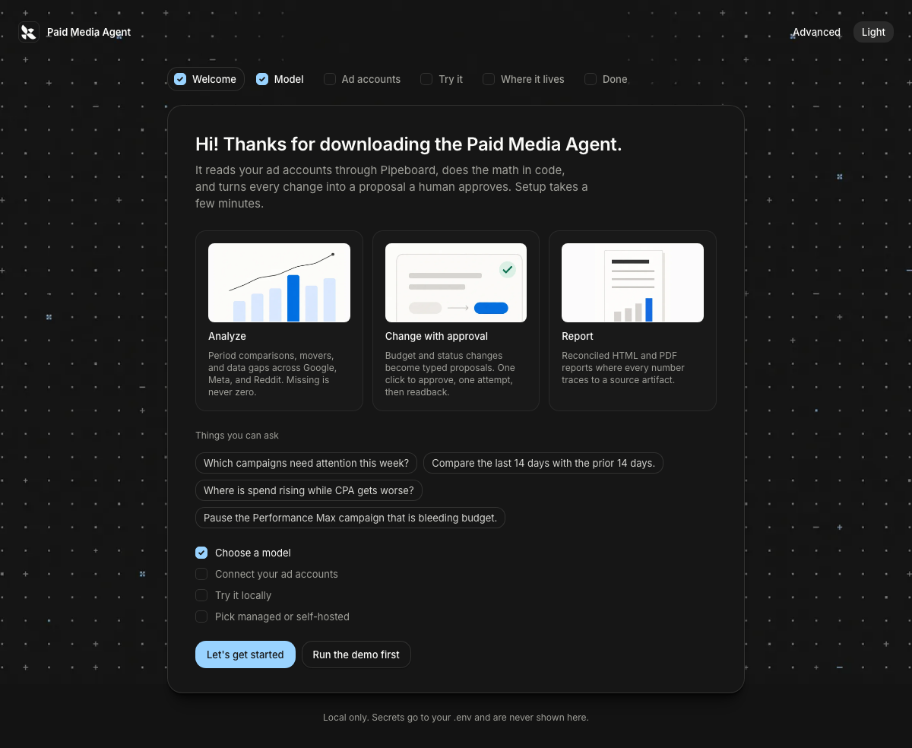
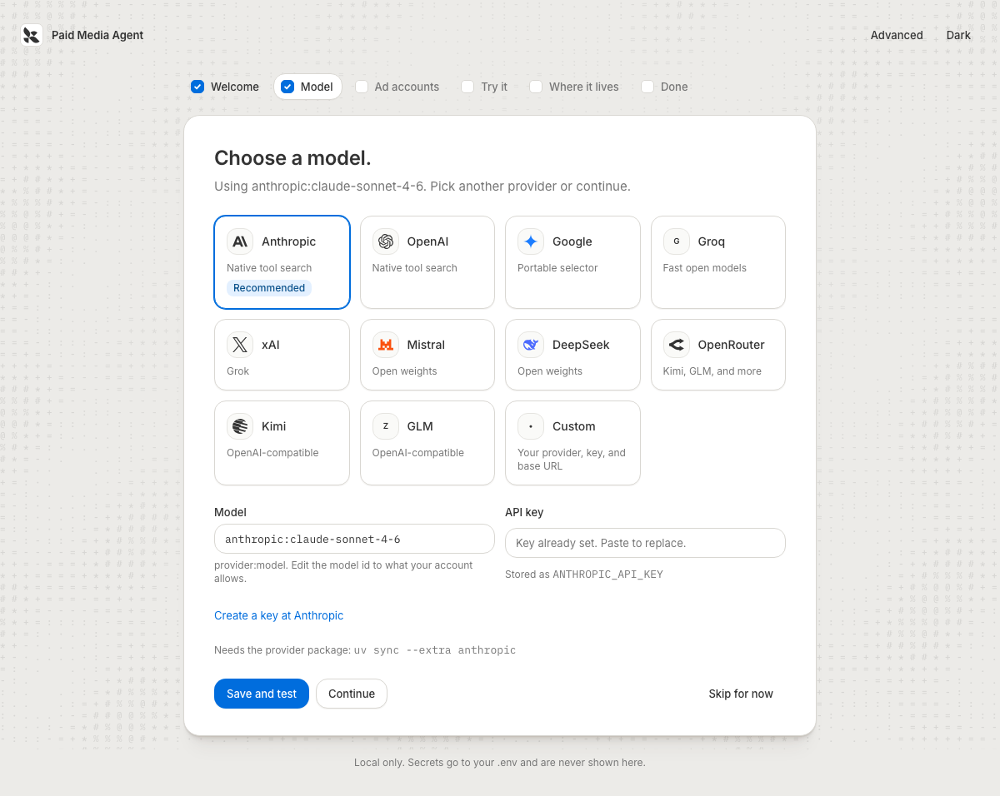
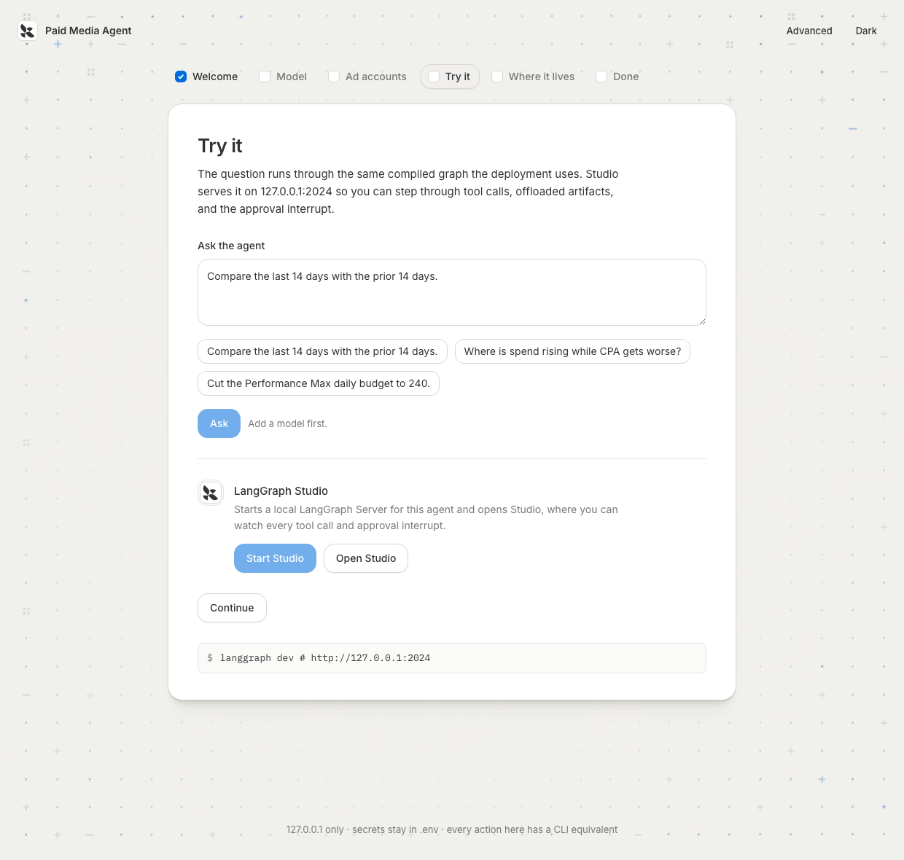
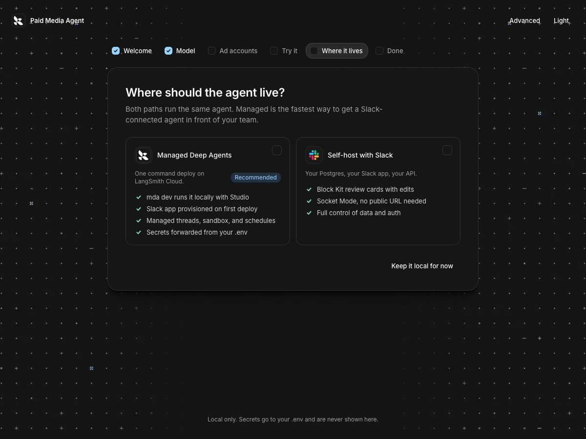

# Paid Media Agent

Paid Media Agent is an open-source Deep Agents application for analyzing and safely managing paid
platforms through Pipeboard. One shared agent core powers local development, Managed Deep Agents
(MDA), self-hosted deployments, Slack, and an Agent UI.

A developer should be able to:

- clone the repository and run a useful fixture-backed demo without connecting an ad account;
- choose any supported tool-calling model directly, without a LangSmith Gateway;
- connect Google Ads, Meta Ads, Reddit Ads, and other supported platforms through Pipeboard;
- ask business questions across campaigns, audiences, creatives, spend, conversions, and pipeline;
- generate reconciled reports from deterministic calculations;
- review an exact proposed change before any provider mutation runs;
- deploy the simple Slack experience through MDA or use the rich Slack adapter locally and in a
  self-hosted environment;
- use the same threads, proposals, reports, and receipts from an Agent UI.

## Architecture

The model investigates, chooses evidence, and explains results. Trusted code owns tool authorization,
account identity, arithmetic, validation, reconciliation, approval state, provider mutation, readback,
and report layout.

```text
Slack / Agent UI / API / schedule
              |
       shared agent assembly
              |
  skills + business wiki + middleware
              |
 authorized Pipeboard catalog + deterministic tools
              |
 proposal -> approval -> one mutation -> readback -> receipt
```

Provider-native deferred tool search is used only when the selected OpenAI or Anthropic model supports
it. Other models use `LLMToolSelectorMiddleware`. Both paths finish by resolving the selected name and
schema against the same host-owned authorized catalog.

## Runtime profiles

| Profile | Best for | What it provides |
|---|---|---|
| Local | development and demos | fixture data, local filesystem, local graph, optional Slack Socket Mode |
| MDA | fastest managed deployment | managed threads, checkpoints, sandbox, schedules, observability, and native Slack |
| Self-hosted | full infrastructure and UX control | Postgres-backed state, rich Slack, custom auth, custom API, and optional Agent UI |

The profiles share business logic and tool policy. A surface adapter may render differently, but it
cannot grant a capability or bypass an approval.

## Quick start

```bash
uv sync --all-extras --dev
uv run paid-media-agent setup
```

`setup` opens a local-only onboarding page and walks you through it in a few minutes:

1. **Model.** Pick a provider card (Anthropic recommended; OpenAI, Google, Groq, xAI, Mistral,
   DeepSeek, OpenRouter, Kimi, GLM, or a custom endpoint), paste the key, and test one call. Keys
   are stored under the name you choose in your local `.env`.
2. **Ad accounts.** Paste a scoped Pipeboard token, load the live catalog, and tick the accounts
   the agent may read. The model only ever sees the aliases you assign.
3. **Try it.** Ask a question in the page, or start LangGraph Studio to watch the graph run, tool
   by tool, including the approval interrupt.
4. **Where it lives.** Managed Deep Agents (recommended: `mda dev` locally, one command deploy,
   Slack provisioned) or self-host with your own Slack app and Postgres.

Every step shows the CLI command it runs, so a coding agent can do the same without a browser:

```bash
uv run paid-media-agent demo --with-proposal        # fixture demo through the real graph
uv run paid-media-agent doctor --json               # every check, machine-readable
uv run paid-media-agent config set PAID_MEDIA_MODEL=anthropic:claude-sonnet-4-6 ANTHROPIC_API_KEY=...
uv run paid-media-agent test model|pipeboard|slack|db|all --json
uv run paid-media-agent accounts discover|list|add|remove
uv run langgraph dev                                # local LangGraph Server + Studio
uv run paid-media-agent serve                       # self-hosted API
uv run paid-media-agent slack                       # rich Slack adapter (Socket Mode)
uv run paid-media-agent mda check|dev|deploy --yes  # managed path
uv run paid-media-agent writes kill-switch on|off   # incident switch
```

The page binds to localhost, needs the per-run token from the printed link, writes only to your
local `.env` (mode 0600), and never displays a secret value.







## Managed Deep Agents path

`agent.py` exports the definition MDA needs; `instructions.md`, `skills/`, and `channels/slack.py`
are the managed project files. With a LangSmith API key in `.env`:

```bash
uv run mda dev        # local managed run with LangSmith Studio
uv run mda deploy .   # hosted deployment; provisions native Slack from channels/slack.py
```

Native Slack supports approve and reject on `execute_change`. Use the rich adapter
(`paid-media-agent slack`) when reviewers need edits, receipts, and files in Block Kit.

## Release status

The first tagged release is gated on the items in [open-questions.md](open-questions.md). The
repository ships under the [Apache-2.0 license](LICENSE) as the recommended default pending
maintainer approval, with a [security policy](SECURITY.md), [contributing guide](CONTRIBUTING.md),
[changelog](CHANGELOG.md), and CI that runs the offline suite, the fixture demo, and a secret scan.

## Start here

- [Product and engineering specification](SPEC.md)
- [Implementation prompt for Claude Fable 5.1](IMPLEMENTATION_PROMPT.md)
- [Architecture index](docs/architecture/README.md)
- [Paid-media business context](docs/business-context/README.md)
- [Source inventory](prep/source-inventory.md)
- [Operating contract](AGENTS.md)
- [Live-write canary runbook](docs/operations/live-write-runbook.md)
- [Examples](examples/README.md) and [migration notes](docs/migration.md)

## Public-release boundary

The repository must not contain customer data, company-specific account identifiers, private
thresholds, production history, credentials, internal Slack or Notion links, or copied proprietary
fixtures. The license, trademark wording, and maintainer security contact are explicit release gates
in [open-questions.md](open-questions.md).

