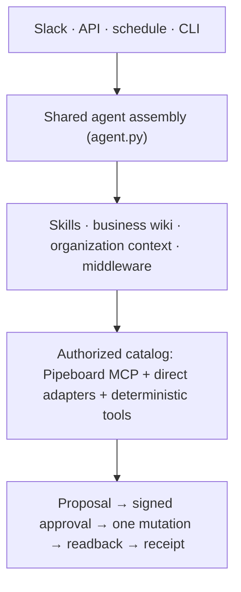

<div align="center">

# Paid Media Agent

**Ask questions across your ad accounts. Approve every change before it happens.**<br>
One agent for Google, Meta, Reddit, LinkedIn, X, and OpenAI Ads, deployed to Slack in one command.

[](https://github.com/amal-irgashev/paid-media-agent-open-source/actions/workflows/ci.yml)
[](LICENSE)
[](pyproject.toml)
[](https://docs.langchain.com/oss/python/deepagents/overview)
[](#where-it-runs)

[Quick start](#quick-start) · [What it does](#what-it-does) · [Where it runs](#where-it-runs) · [Onboarding](#onboarding) · [Architecture](docs/architecture/README.md) · [Operations](OPERATIONS.md)

<picture>
  <source media="(prefers-color-scheme: dark)" srcset="docs/screenshots/setup-welcome-dark.png">
  
</picture>

</div>

Paid Media Agent is an open-source [Deep Agents](https://docs.langchain.com/oss/python/deepagents/overview)
application for analyzing and safely managing paid media. The model investigates, chooses evidence,
and explains. Trusted code owns everything that must be exact: which tools exist, which accounts
they may touch, the arithmetic, the approval, the single mutation attempt, and the receipt.

## Quick start

Python 3.11 or newer and [uv](https://docs.astral.sh/uv/). No ad account and no model key for the
first two commands.

```bash
uv sync --all-extras --dev
uv run paid-media-agent demo --with-proposal   # synthetic accounts through the real agent, including one approved change
uv run paid-media-agent setup                  # the local setup console
```

The demo runs a two-week comparison across three synthetic accounts, proposes a budget change,
approves it, executes it against a fake provider, reads the result back, and prints the receipt.
From there the console takes you to a real model, real accounts, and a deployment.

## What it does

| | The model does | Code does |
|---|---|---|
| **Analyze** | Picks the window, the accounts, and the grain; explains what moved and why it matters | Period comparison in `Decimal`, per platform; missing metrics stay missing; cross-platform totals are suppressed when sources disagree |
| **Change** | Proposes a typed change with a reason, a measurement plan, and a reversal plan | Persists the proposal, requires a signed single-use approval bound to that exact revision, makes one mutation attempt, reads the platform back, and returns an honest receipt: verified, failed, or unknown |
| **Report** | Asks for the report and writes the executive summary | Renders a versioned payload to HTML and PDF where every number reconciles to a source artifact; weekly and monthly runs ship as schedules |

Ask it things like *Compare the last 14 days with the prior 14 days*, *Where is spend rising while
CPA gets worse*, or *Cut the Performance Max daily budget to 240*. The third one ends in an
approval card, never in a silent write.

## Where it runs

Both paths compile the same components from `agent.py`. A surface can render differently, but it
cannot grant a capability or bypass an approval.

| | Managed Deep Agents, recommended | Self-host |
|---|---|---|
| Deploy | `uv run mda deploy .` | `docker compose up` |
| You get | Slack, weekly and monthly schedules, threads, a sandbox per thread, identity, all managed on LangSmith Cloud | Your own API, Postgres, and a Slack app you own, with Block Kit review cards and edits |
| Setup time | One LangSmith key and one command | A Slack app, a database URL, and API tokens; the console walks through each |
| Local run | `uv run mda dev` with LangSmith Studio | `uv run paid-media-agent serve` and `uv run paid-media-agent slack` |
| Guide | [Deploying with Managed Deep Agents](OPERATIONS.md#deploying-with-managed-deep-agents) | [docs/self-hosting.md](docs/self-hosting.md) |

Before either, try it where you are:

```bash
uv run paid-media-agent ask "How did spend move week over week?"
uv run paid-media-agent report --cadence weekly   # deterministic HTML and PDF, no model in the loop
uv run paid-media-agent doctor --json             # every check, machine-readable
```

## Built for trust

- **Deny by default.** Provider tools enter through an authorized catalog built in host code. Anything without a read-only annotation or a reviewed policy row is not a tool the model can call.
- **Host-owned identity.** The model sees account aliases, never provider ids or credentials. Approvers are a host-side allowlist; where a card is posted is never authorization.
- **One mutation attempt.** A change runs once, behind a kill switch, a global flag, a pinned catalog revision, and a canary allowlist. Uncertain outcomes are reported as unknown, never retried.
- **Chat that reads like chat.** Plain text with the source window and artifact cited; no markdown in Slack.
- **Nothing phones home.** The agent talks only to the providers you configure. Adoption tracking is a written plan, not a default.

## Platforms

| Platform | Path | Reads | Writes |
|---|---|---|---|
| Google Ads, Meta Ads, Reddit Ads | [Pipeboard](https://pipeboard.co) Streamable HTTP MCP | live catalog, classified by MCP annotations | admitted rows only, behind the write gates |
| LinkedIn Ads | direct adapter, OAuth 2.0 with refresh | accounts, campaigns, creatives, daily analytics | none in v1 |
| X Ads | direct adapter, OAuth 1.0a | accounts, campaigns, line items, daily stats | none in v1 |
| OpenAI Ads | direct adapter, bearer key | account, campaigns, ad groups, daily insights | none in v1 |

Direct platforms join the same authorized catalog as Pipeboard tools whenever their credentials are
configured, so alias scope, schema validation, artifact offload, and `compare_periods` work the same
way across all six.

## Onboarding

`uv run paid-media-agent setup` opens a local-only page (127.0.0.1, per-run token, writes only your
`.env`) with seven steps: **Model**, **Ad accounts**, **Your business**, **Try it**, **Where it
lives**, then **Deploy** or **Self-host**, and **Done**. Every step shows the CLI command it runs,
so a coding agent can do the same without a browser.

- **Your business** is eight plain questions plus any briefs or exports you share. The agent reads
  them before every analysis through `get_org_context`, and it can run the same interview in chat.
  Answers live under `docs/org/`, which stays out of git.
- **Inside your editor.** Claude Code desktop opens the console in its Browser pane from the `setup`
  entry in `.claude/launch.json`; Cursor and the Codex app open it in their built-in browser
  (`uv run paid-media-agent setup --no-open --no-token`).
- **Models.** `PAID_MEDIA_MODEL` is `provider:model`. Anthropic and OpenAI keys unlock
  provider-native tool search; every other tool-calling model, including the LangSmith Gateway
  (`langsmith:anthropic/claude-sonnet-4-6`), uses a portable selector over the same catalog.

## How it is built



Deep Agents runs the loop. Middleware selects a bounded tool set per turn, guards every invocation
against the catalog, offloads large results to workspace artifacts, and redacts secrets. The
business wiki and the skills are versioned prose the agent reads at run time, reviewable in a pull
request like any other change.

## Documentation

- [Architecture](docs/architecture/README.md), [operations and command reference](OPERATIONS.md), [self-hosting](docs/self-hosting.md)
- [Business wiki](skills/paid-media-wiki/SKILL.md) the agent reads, and the [analysis](skills/paid-media-analysis/SKILL.md), [writes](skills/paid-media-writes/SKILL.md), and [onboarding](skills/paid-media-org-onboarding/SKILL.md) skills
- [Operating contract for humans and coding agents](AGENTS.md)
- [Contributing](CONTRIBUTING.md), [security policy](SECURITY.md), [changelog](CHANGELOG.md), [open questions before release](open-questions.md)
- [The open-source principles this repository holds itself to](docs/open-source-principles.md)

## License

Apache 2.0. The repository never contains customer data, account identifiers, private thresholds,
credentials, or copied proprietary material.
