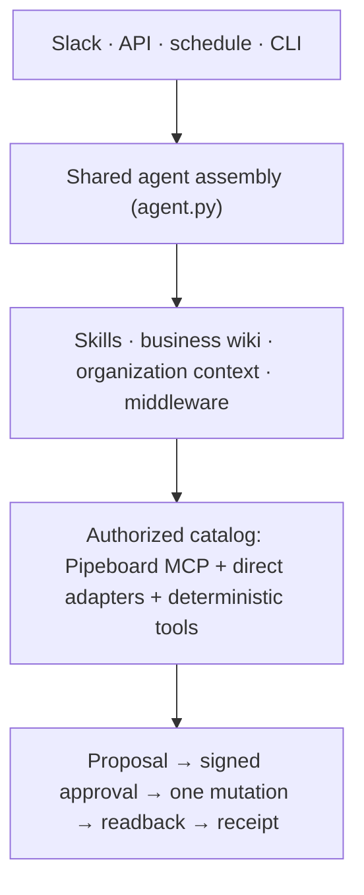

<div align="center">
  <a href="https://github.com/amal-irgashev/paid-media-agent-open-source">
    <h1>Paid Media Agent</h1>
  </a>
</div>

<div align="center">
  <h3>Ask questions across your ad accounts. Approve every change before it happens.</h3>
</div>

<div align="center">
  <a href="LICENSE" target="_blank"></a>
  <a href="https://github.com/langchain-ai/deepagents" target="_blank"></a>
  <a href="https://github.com/langchain-ai/langgraph" target="_blank"></a>
  <a href="https://docs.langchain.com/langsmith/python/managed-deep-agents" target="_blank"></a>
</div>

<br>

A team that runs paid media on more than one platform inherits the same set of problems. Each
platform reports in its own schema, so spend, conversions, and conversion value do not line up
across channels without arithmetic. Campaign parameters are hard to connect to the outcomes the
business cares about, such as sales inquiries, signups, or content downloads. And every change,
from a budget cut to a paused campaign, happens in a vendor console that keeps no record of who
decided it or why.

Paid Media Agent is the open-source agent we built for that operating problem. It reads Google,
Meta, Reddit, LinkedIn, X, and OpenAI Ads through one authorized tool catalog, computes every
comparison in code, and turns each requested change into a typed proposal that a named person
approves before a single mutation runs. The model investigates, chooses evidence, and explains.
Code owns the tool list, the account identity, the arithmetic, the approval, the mutation, and
the receipt.

It deploys to Slack in one command with Managed Deep Agents, or self-hosts behind your own API,
Postgres, and Slack app. Both paths compile the same components, so a surface can change how a
result looks but not what the agent is allowed to do.

> [!NOTE]
> Paid Media Agent is under active development. Live provider writes stay behind release gates
> until a separately authorized canary; everything else runs today.

<div align="center">
  <picture>
    <source media="(prefers-color-scheme: dark)" srcset="docs/screenshots/setup-welcome-dark.png">
    
  </picture>
</div>

[Quick start](#quick-start) · [What it does](#what-it-does) · [Where it runs](#where-it-runs) · [Onboarding](#onboarding) · [Architecture](docs/architecture/README.md) · [Operations](OPERATIONS.md)

## Quick start

The first two commands need no ad account and no model key. The demo drives the real agent with
a scripted model against three synthetic accounts, so the install is proven before any credential
exists. Python 3.11 or newer and [uv](https://docs.astral.sh/uv/) are the only prerequisites.

```bash
uv sync --all-extras --dev
uv run paid-media-agent demo --with-proposal   # synthetic accounts through the real agent, including one approved change
uv run paid-media-agent setup                  # the local setup console
```

The demo compares the last two weeks with the two before across the three accounts, proposes a
budget change, approves it as the local user, executes it against a fake provider, reads the value
back, and prints the receipt. The console then walks from a real model to real accounts to a
deployment.

## What it does

Three jobs, split the same way each time.

| | The model | Code |
|---|---|---|
| **Analyze** | Picks the window, the accounts, and the grain, then explains what moved and why it matters | Reads each platform once for the union of both windows, compares periods in `Decimal`, keeps missing metrics missing, and withholds a cross-platform total when windows, currencies, or coverage disagree |
| **Change** | Proposes a typed change with a reason, a measurement plan, and a reversal plan | Persists the proposal under a digest, requires a signed single-use approval bound to that revision, makes one mutation attempt, reads the platform back, and records a receipt that says verified, failed, or unknown |
| **Report** | Asks for the report and writes the executive summary | Renders a versioned payload to HTML and PDF in which every number reconciles to a source artifact; the weekly and monthly runs are schedules |

The model decides. Code computes.

Ask it *Compare the last 14 days with the prior 14 days*, *Where is spend rising while CPA gets
worse*, or *Cut the Performance Max daily budget to 240*. The third ends in an approval card,
never in a silent write.

## Where it runs

Teams differ in what they are allowed to operate, so there are two deployment paths on one code
base. Managed Deep Agents supplies the threads, the sandbox, the schedules, identity, and Slack;
self-hosting keeps all of that on infrastructure you run.

| | Managed Deep Agents, recommended | Self-host |
|---|---|---|
| Deploy | `uv run mda deploy .` | `docker compose up` |
| You run | Nothing; LangSmith Cloud hosts threads, a sandbox per thread, weekly and monthly schedules, identity, and the Slack app | Your API, Postgres, and a Slack app you own, with Block Kit review cards and edits |
| Setup | One LangSmith key and one command | A Slack app, a database URL, and API tokens; the console collects each |
| Local run | `uv run mda dev` with LangSmith Studio | `uv run paid-media-agent serve` and `uv run paid-media-agent slack` |
| Guide | [Deploying with Managed Deep Agents](OPERATIONS.md#deploying-with-managed-deep-agents) | [docs/self-hosting.md](docs/self-hosting.md) |

Before either, the same profile runs on your machine:

```bash
uv run paid-media-agent ask "How did spend move week over week?"
uv run paid-media-agent report --cadence weekly   # deterministic HTML and PDF, no model in the loop
uv run paid-media-agent doctor --json             # every check, machine-readable
```

## What code guarantees

- **Deny by default.** Provider tools enter through a catalog that host code builds from MCP
  annotations and a reviewed policy file. A tool without a read-only annotation or an admitted
  policy row does not exist to the model.
- **Host-owned identity.** The model sees account aliases, never provider ids or credentials.
  Approvers are an allowlist the host reads; where a card is posted is never authorization.
- **One attempt.** A live mutation needs the kill switch clear, the global flag on, the catalog
  revision pinned to the one an operator reviewed, and the tool on the canary list. The executor
  calls the provider once. An uncertain outcome is reported as unknown and never retried.
- **Plain text in chat.** Answers cite the window and the artifact they came from and carry no
  markdown, because Slack renders none.
- **Nothing phones home.** The agent talks only to the providers you configure. Adoption tracking
  is a written plan, off by default.

## Platforms

[Pipeboard](https://pipeboard.co) already holds the OAuth for Google, Meta, and Reddit and exposes
each as an MCP server, so the agent loads that catalog instead of owning three more integrations.
LinkedIn, X, and OpenAI Ads are not on Pipeboard; small direct adapters place their read tools in
the same catalog, so alias scope, schema validation, artifact offload, and `compare_periods` work
the same way across all six.

| Platform | Path | Reads | Writes |
|---|---|---|---|
| Google Ads, Meta Ads, Reddit Ads | Pipeboard Streamable HTTP MCP | live catalog, classified by MCP annotations | admitted rows only, behind the write gates |
| LinkedIn Ads | direct adapter, OAuth 2.0 with refresh | accounts, campaigns, creatives, daily analytics | none in v1 |
| X Ads | direct adapter, OAuth 1.0a | accounts, campaigns, line items, daily stats | none in v1 |
| OpenAI Ads | direct adapter, bearer key | account, campaigns, ad groups, daily insights | none in v1 |

## Onboarding

Most of what the agent needs on its first day is not in the code: which model, which accounts,
what the business sells, which conversion counts, who may approve a change. `uv run
paid-media-agent setup` collects exactly that on a local-only page (127.0.0.1, per-run token,
writes only your `.env`) in seven steps: **Model**, **Ad accounts**, **Your business**, **Try
it**, **Where it lives**, then **Deploy** or **Self-host**, and **Done**. Every step shows the CLI
command it runs, so a coding agent can do the same without a browser.

- **Your business** is eight plain questions plus any briefs or exports you share. The agent reads
  the answers before every analysis through `get_org_context`, can run the same interview in chat,
  and stores them under `docs/org/`, which stays out of git.
- **Inside your editor.** Claude Code desktop opens the console in its Browser pane from the
  `setup` entry in `.claude/launch.json`; Cursor and the Codex app open it in their built-in
  browser (`uv run paid-media-agent setup --no-open --no-token`).
- **Models.** `PAID_MEDIA_MODEL` is `provider:model`. Anthropic and OpenAI keys unlock
  provider-native tool search; every other tool-calling model, including the LangSmith Gateway
  (`langsmith:anthropic/claude-sonnet-4-6`), uses a portable selector over the same catalog.

## How it is built



Deep Agents runs the loop. Middleware selects a bounded tool set per turn, checks every call
against the catalog before it runs, writes large results to workspace artifacts and returns a
summary, and redacts secrets from anything the model sees. The business wiki and the skills are
prose files the agent reads at run time, so a change in judgment is a pull request, not a
deploy. The wiki and the skills should work at another company; the organization context should
not, which is why it lives outside git.

## Documentation

- [Architecture](docs/architecture/README.md), [operations and command reference](OPERATIONS.md), [self-hosting](docs/self-hosting.md)
- [Business wiki](skills/paid-media-wiki/SKILL.md) the agent reads, and the [analysis](skills/paid-media-analysis/SKILL.md), [writes](skills/paid-media-writes/SKILL.md), and [onboarding](skills/paid-media-org-onboarding/SKILL.md) skills
- [Operating contract for humans and coding agents](AGENTS.md)
- [Contributing](CONTRIBUTING.md), [security policy](SECURITY.md), [changelog](CHANGELOG.md), [open questions before release](open-questions.md)
- [The open-source principles this repository holds itself to](docs/open-source-principles.md)

## License

Apache 2.0. The repository never contains customer data, account identifiers, private thresholds,
credentials, or copied proprietary material.
