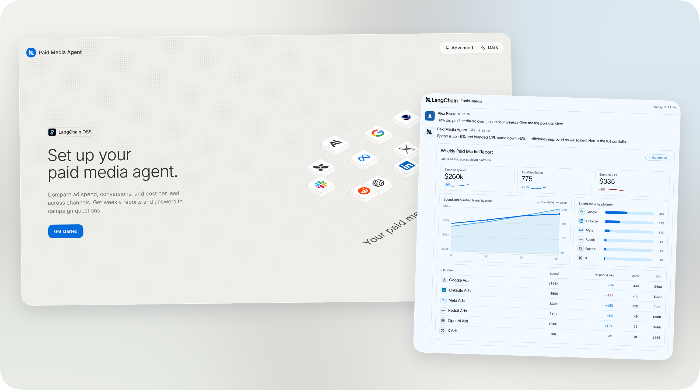

<div align="center">
  <p>
    <a href="https://www.langchain.com/">
      <picture>
        <source media="(prefers-color-scheme: dark)" srcset="docs/assets/langchain-oss-dark.svg">
        
      </picture>
    </a>
  </p>
  <h1>Paid Media Agent</h1>
  <p>Cross-channel campaign analysis and reporting.<br>Built on <a href="https://github.com/langchain-ai/deepagents">Deep Agents</a>. Deploy with <a href="https://docs.langchain.com/langsmith/python/managed-deep-agents-overview">Managed Deep Agents</a>.</p>
  <p>
    <a href="#quick-start">Quick start</a> ·
    <a href="#deployment">Deployment</a> ·
    <a href="OPERATIONS.md">Documentation</a> ·
    <a href="CONTRIBUTING.md">Contributing</a>
  </p>
</div>

<a href="docs/screenshots/readme-overview-light.png">
  
</a>

<p align="center">
  <sub><a href="docs/screenshots/setup-preview-light.png">Setup console</a> · <a href="docs/screenshots/report-illustration.png">Report illustration</a> with example figures. Presentation varies by runtime.</sub>
</p>

An open-source agent that reads your ad accounts, compares campaign performance, and produces
answers and reports. Use it in Slack or the terminal, with your choice of model and hosting.

Built from the tools, skills, and reporting patterns behind LangChain's Paid Media Agent.

## What it does

- **Compare performance:** spend, conversions, cost per lead, and budget pacing.
- **Investigate changes:** identify the campaigns behind a shift and flag missing data.
- **Produce reports:** weekly or monthly summaries, campaign tables, and recommendations.
  Download HTML, or PDF when the rendering libraries are installed.

The model decides what to investigate. Code calculates the metrics and checks report figures
against the source data.

**Ad account changes are off by default.** Live changes require approval and
[additional release checks](docs/operations/live-write-runbook.md). The project is under active development.

## Quick start

Requires **Python 3.11+** and [uv](https://docs.astral.sh/uv/).

```bash
git clone https://github.com/langchain-ai/open-paid-media-agent.git
cd open-paid-media-agent
uv sync --all-extras
uv run paid-media-agent setup
```

The setup console opens in your browser at [localhost:8765](http://localhost:8765):

1. **Model:** choose a provider and add its API key.
2. **Accounts:** connect your platforms and select accounts, or start with sample data.
3. **Deployment:** choose Managed Deep Agents or self-hosting.

Using a coding agent? Point it to [AGENTS.md](AGENTS.md) and the
[onboarding skill](skills/paid-media-onboarding/SKILL.md). The CLI supports the same setup
actions with JSON output. No frontend build is required.

<details>
<summary>Try the offline demo without keys or ad accounts</summary>

```bash
uv run paid-media-agent demo --with-proposal
```

Runs a scripted analysis and simulated budget change against synthetic accounts. No model key
or live account access is needed.

</details>

Once your model and data are configured, try:

```bash
uv run paid-media-agent ask "Which campaigns had the largest increase in cost per lead last week?"
uv run paid-media-agent report --cadence weekly
```

## Accounts and business context

| Connection | Platforms |
| --- | --- |
| [Pipeboard MCP](https://pipeboard.co/integrations) | Google Ads, Meta Ads, TikTok Ads, Pinterest Ads, Snap Ads, Reddit Ads, LinkedIn Ads, Google Analytics |
| [Direct adapters](OPERATIONS.md#direct-platforms) | X Ads, OpenAI Ads |

Connect any subset. Tools and metrics depend on platform permissions and API access.
Direct adapters are read-only.

Add your goals, conversion definitions, and campaign briefs before the first real analysis.
Use the [business-context skill](skills/paid-media-org-onboarding/SKILL.md) with your coding agent,
or the terminal interview:

```bash
uv run paid-media-agent org interview
```

Settings live in `.env`, account mappings in `config/accounts.toml`, and business context in
`docs/org/`. All are Git-ignored.

## Deployment

Both paths run the same agent core. After configuring the project:

| | Managed Deep Agents · recommended | Self-hosted |
| --- | --- | --- |
| Start | **Deploy agent** in setup, or `uv run mda deploy .` | `docker compose up -d --build` on your Docker host |
| Hosting | Managed by LangSmith | You operate the API and Postgres |
| Slack | Managed app with workspace authorization | Your app, using a separate Socket Mode process or signed HTTP |
| Reports | Managed weekly and monthly schedules | Run the report command with your scheduler |
| Guide | [Managed deployment](OPERATIONS.md#deploying-with-managed-deep-agents) | [Self-hosting](docs/self-hosting.md) |

**Managed Deep Agents** needs a LangSmith organization with MDA access and an API key with
deployment permissions. Authorize Slack when prompted. The sandbox builds automatically and
reuses its snapshot until the recipe changes. [Hosting is paid](https://www.langchain.com/pricing).

**Self-hosting** needs Docker and generated API credentials. Compose starts the API and Postgres;
the guide covers Slack setup. The image includes PDF libraries. You operate the infrastructure.

Model and connector charges apply to either path. For local development, use `uv run mda dev`
to inspect runs in LangSmith Studio.

## Build on it

Skills describe how to analyze paid media. Your business context defines goals and conversions.
Tools supply current account data, with only relevant tools loaded from the catalog.

One shared agent assembly serves both deployment paths. Edit its instructions, add skills, or
extend its tools without maintaining a separate agent for each interface.

| Change or explore | Start here |
| --- | --- |
| Agent instructions and paid-media knowledge | [instructions.md](instructions.md) · [skills/](skills/) |
| Tools and runtime | [src/paid_media_agent/](src/paid_media_agent/) · [Architecture](docs/architecture/README.md) |
| Managed channels and schedules | [channels/](channels/) · [schedules/](schedules/) · [sandbox/](sandbox/) |
| Configuration and troubleshooting | [Operations](OPERATIONS.md) |
| Development and tests | [Contributing](CONTRIBUTING.md) · [Agent instructions](AGENTS.md) |

Use synthetic data for development. Run `make check` before submitting a change; see
[Contributing](CONTRIBUTING.md) for the development dependencies and checks.

---

[Apache 2.0](LICENSE) · [Changelog](CHANGELOG.md) · [Security](SECURITY.md) · [Code of conduct](CODE_OF_CONDUCT.md)
