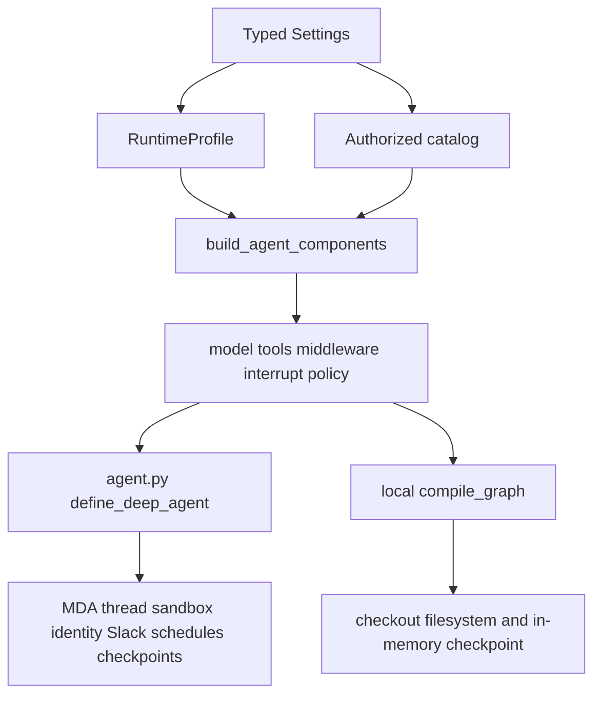

# Shared Agent Assembly and Runtime Boundaries

The application has one agent definition, not separate “local” and “hosted” policy implementations. `build_agent_components` builds the model, authorized tools, middleware, approval interrupt configuration, prompt, and host services from typed settings, a `RuntimeProfile`, and an authorized catalog; it is explicitly designed to avoid network calls and process-global mutable state. [assembly.py](repo://src/paid_media_agent/assembly.py#L181-L198)

`main` deploys through **Managed Deep Agents (MDA)**. `agent.py` is deliberately thin: at import time it creates `Settings`, obtains MDA-profile components, and passes their model, tools, middleware, and interrupt map to `define_deep_agent` as `paid-media-agent`. [agent.py](repo://agent.py#L1-L20) Self-hosting is not an alternative deployment mode on `main`: the API, Postgres, rich Slack transports, per-process sandbox backend, and LangGraph Server factory belong to the frozen `self-hosted` branch. [self-hosting.md](repo://docs/self-hosting.md#L1-L21)

## Assembly versus runtime ownership

The shared assembly is the policy-bearing core. A runtime profile supplies the things that must vary by environment: artifact store, account aliases, catalog and provider adapters, write and approval policy, signing key, proposal/approval/receipt repositories, run mode, skill root, and additional secret values. [profiles.py](repo://src/paid_media_agent/runtime/profiles.py#L37-L58) From these dependencies the assembly creates one `ReadDispatcher`, `ProposalService`, and `WriteExecutor`, then gives the same service instances to the tools and returns them with the compiled component bundle. [assembly.py](repo://src/paid_media_agent/assembly.py#L115-L146) [assembly.py](repo://src/paid_media_agent/assembly.py#L275-L285)

This split is important when changing behavior:

- Put shared capability, tool-surface, selection, redaction, and approval-interrupt behavior in `assembly.py`, rather than branching it by transport.
- Put provider selection, storage implementations, account mappings, paths, and environment-derived approval/write inputs in `RuntimeProfile` construction.
- Keep provider account IDs host-side. `AccountRegistry` exposes aliases to the model and resolves them to provider bindings internally. [config.py](repo://src/paid_media_agent/config.py#L52-L81)
- Do not attach a provider MCP surface directly to the model. The configured catalog is the admission boundary; the architecture intentionally avoids an MDA MCP connector that would bypass it. [runtime-profiles.md](repo://docs/architecture/runtime-profiles.md#L49-L60)

This diagram shows the one assembly feeding two compilers while runtime infrastructure remains outside the shared policy core.

## Configured profile and catalog selection

`configured_profile` is the profile used by both MDA assembly and the configured local runtime. It loads the catalog, validates the reviewed write policy against the current catalog, starts with a fixture-backed profile named `mda`, applies approval policy derived from settings, and replaces the read/write adapters only when the loaded catalog is fully live. A live catalog therefore uses live reads plus a gated live write provider and is marked non-fake; the fixture fallback remains fake. [mda.py](repo://src/paid_media_agent/runtime/mda.py#L45-L66)

Catalog loading decides what “configured” means:

- Without a Pipeboard token and without direct-platform credentials, it returns the fixture catalog and no live providers. [catalog.py](repo://src/paid_media_agent/runtime/catalog.py#L39-L61)
- Direct adapters join the same authorized catalog when their credentials exist; without Pipeboard this combines fixture Pipeboard platforms with direct providers. [catalog.py](repo://src/paid_media_agent/runtime/catalog.py#L42-L73)
- With a Pipeboard token, the loader incorporates admitted mutation names from the reviewed policy file before refreshing the live catalog, then returns the composite read provider and Pipeboard write provider. [catalog.py](repo://src/paid_media_agent/runtime/catalog.py#L74-L95)

The profile constructs `WriteGate` from settings on every assembly: write enablement, fake/live provider status, kill-switch location, released catalog revision, canary-tool list, and a callback to the current catalog revision are all gate inputs. [profiles.py](repo://src/paid_media_agent/runtime/profiles.py#L60-L72) Approval policy similarly derives authorized approver references, self-approval policy, and TTL from settings. [profiles.py](repo://src/paid_media_agent/runtime/profiles.py#L111-L119) Thus changing `PAID_MEDIA_APPROVER_IDS`, the reviewed catalog revision, canary list, or write enablement changes the runtime policy dependency—not the graph topology.

## Policy-controlled component surface

The assembly constructs core tools, catalog-backed read tools, and—because every current profile is in `conversation` mode—governed write tools. It does **not** expose raw provider mutations as model-callable tools. The allowed surface is the selected product tools plus six filesystem tools; Deep Agents built-ins `task`, `execute`, and `delete` are hidden. [assembly.py](repo://src/paid_media_agent/assembly.py#L58-L74) [assembly.py](repo://src/paid_media_agent/assembly.py#L202-L227) [authorization.py](repo://src/paid_media_agent/middleware/authorization.py#L21-L34)

`InvocationGuardMiddleware` filters unavailable tools before a model call and rejects calls outside the surface. It also rejects any catalog entry that is not classified as a read, forcing provider mutations through `propose_change` and `execute_change`. [authorization.py](repo://src/paid_media_agent/middleware/authorization.py#L58-L103) When write tools are present, only `execute_change` receives an interrupt configuration, built from the shared proposal service. [assembly.py](repo://src/paid_media_agent/assembly.py#L251-L253)

## Middleware registration order and failure bounds

The tuple returned by the assembly registers middleware in this order:

1. For non-scripted models only: retry (at most two retries, continue on failure), asynchronous model timeout, and a model-call run limit.
2. Current-date stamping.
3. Model-aware tool selection, if the profile/model requires it.
4. Invocation guard.
5. Result offload.
6. Secret redaction.

The order and the conditional retry block are defined at the point of assembly. [assembly.py](repo://src/paid_media_agent/assembly.py#L229-L250) This is a contract worth preserving: guard placement keeps the selected surface policy-controlled, while output handling prevents oversized results and credentials from needlessly entering model context.

The supporting failure semantics are deliberate:

- The SDK model is initialized with a request timeout and two SDK retries; an injected model bypasses that initialization. [assembly.py](repo://src/paid_media_agent/assembly.py#L149-L174)
- The timeout middleware cancels stalled **asynchronous** model calls; synchronous calls rely on the SDK timeout because they cannot be safely cancelled. [timeout.py](repo://src/paid_media_agent/middleware/timeout.py#L17-L38)
- Current date is appended on each model call rather than fixed when a long-lived graph is built. [current_date.py](repo://src/paid_media_agent/middleware/current_date.py#L14-L49)
- Tool-selection strategy is selected from model capabilities: registered native-search models use provider search unless a custom base URL is configured; other models use the bounded portable selector, while scripted tests bind all tools. A selector naming invalid tools falls back to always-included core tools rather than widening access. [tool_selection.py](repo://src/paid_media_agent/middleware/tool_selection.py#L149-L177) [tool_selection.py](repo://src/paid_media_agent/middleware/tool_selection.py#L180-L218)
- Results over the configured character budget are persisted as artifacts and replaced with an ID, hash, preview, and retrieval instruction. Paged filesystem-tool results are intentionally exempt to avoid recursive offloading. [offload.py](repo://src/paid_media_agent/middleware/offload.py#L16-L52)
- Redaction removes configured secret values and credential-shaped text from tool results; it also returns a bounded, redacted error message when its wrapped tool handler raises. [redaction.py](repo://src/paid_media_agent/middleware/redaction.py#L31-L46) [redaction.py](repo://src/paid_media_agent/middleware/redaction.py#L49-L87)

## Two compilation paths, different infrastructure

### Managed deployment on `main`

`build_mda_components` resolves the configured profile and invokes the shared builder; `agent.py` gives the resulting bundle to MDA. [mda.py](repo://src/paid_media_agent/runtime/mda.py#L69-L74) MDA owns the infrastructure around that bundle: durable threads and checkpoints, a sandbox per thread, schedules, caller identity, and Slack. [self-hosting.md](repo://docs/self-hosting.md#L3-L6) The supported operational path is `uv run mda dev` for a managed local development session and `uv run mda deploy .` for hosted deployment; the application wrapper runs preflight and requires `--yes` before invoking deploy. [cli.py](repo://src/paid_media_agent/cli.py#L400-L439)

### Local compilation

`compile_graph` passes exactly the shared model, tools, prompt, middleware, skills, and interrupt map to `create_deep_agent`, but supplies a `FilesystemBackend` rooted at the checkout and the caller-provided checkpointer. [local.py](repo://src/paid_media_agent/runtime/local.py#L51-L70) `build_local_runtime` is the injection-friendly fixture/demo/test constructor: it defaults to a fixture catalog/profile and an `InMemorySaver`. [local.py](repo://src/paid_media_agent/runtime/local.py#L73-L107) `build_configured_runtime` instead resolves the same `mda` configured profile used by deployment and compiles it with an in-memory checkpointer; `ask`, `report`, and the setup console’s local try path use this route. [local.py](repo://src/paid_media_agent/runtime/local.py#L110-L132) [cli.py](repo://src/paid_media_agent/cli.py#L458-L515)

Local compilation is therefore a parity mechanism for capabilities and policy, not an emulation of MDA durability or transport services. The test suite specifically checks that the MDA definition contains the shared governed tools, interrupt, and key middleware, and that configured local compilation has the `mda` profile with a fixture fallback when no live credentials are present. [test_surfaces_and_runtimes.py](repo://tests/contract/test_surfaces_and_runtimes.py#L110-L151)

## Filesystem and hosted-context boundary

The hosted model does not receive the checkout. Its MDA sandbox filesystem contains `/skills`—including the synced `skills/paid-media-wiki`—and `/workspace` for that thread’s scratch space. Organization context, artifacts, and report files cross the boundary through host tools and artifact IDs rather than by assuming repository paths. [runtime-profiles.md](repo://docs/architecture/runtime-profiles.md#L25-L33) Host provider/Pipeboard calls likewise run in host tools, not in sandbox-authored code. [sandbox-and-snapshots.md](repo://docs/architecture/sandbox-and-snapshots.md#L27-L31)

By contrast, the local graph exposes the repository through a virtual filesystem backend. Its permissions deny reads and writes for `.env`, `.venv`, `.git`, and `.mda`, allow writes under `/workspace/**`, and deny every other write. [local.py](repo://src/paid_media_agent/runtime/local.py#L28-L38) This keeps local scratch behavior aligned with the hosted `/workspace` convention while acknowledging that local read visibility is wider.

A custom sandbox snapshot may bake stable runtime dependencies such as Python, `rg`, `jq`, WeasyPrint, and Jinja2, but its Dockerfile must not bake skills, wiki, workspace content, or secrets. [Dockerfile](repo://sandbox/Dockerfile#L1-L14) The sandbox probe uploads only `skills`, creates `/workspace/in`, `/workspace/out`, and `/workspace/analysis`, checks for key-like environment values, and is the only host-side code here that executes sandbox shell commands; the model has no shell tool. [sandbox.py](repo://src/paid_media_agent/runtime/sandbox.py#L1-L7) [sandbox.py](repo://src/paid_media_agent/runtime/sandbox.py#L79-L92) [sandbox.py](repo://src/paid_media_agent/runtime/sandbox.py#L178-L190)

## Change and verification checklist

When modifying this boundary, verify both compilers rather than just a single tool call:

1. Run the shared-surface/MDA parity contract in `tests/contract/test_surfaces_and_runtimes.py`; it catches raw mutation and hidden built-in leakage. [test_surfaces_and_runtimes.py](repo://tests/contract/test_surfaces_and_runtimes.py#L110-L136)
2. Run the selection matrix. It verifies both native and portable selection bind only authorized reads, and that hallucinated selector names leave only core tools rather than exposing mutations. [test_selection_matrix.py](repo://tests/contract/test_selection_matrix.py#L71-L99) [test_selection_matrix.py](repo://tests/contract/test_selection_matrix.py#L143-L169)
3. Exercise write-gate failures before any live change. The contract verifies disabled writes, missing/stale release revision, unreleased tools, and the kill switch all prevent provider calls. [test_live_write_gates.py](repo://tests/contract/test_live_write_gates.py#L75-L167)
4. If a snapshot changes, run `uv run paid-media-agent sandbox test`; the probe tests mount paths, PDF rendering, workspace layout, and absence of secrets. [sandbox.py](repo://src/paid_media_agent/runtime/sandbox.py#L155-L190)

For setup and deployment details, see the related [local setup and managed deployment](/openwiki/operations/local-setup-and-managed-deployment.md) and [sandbox and hosted context](/openwiki/operations/sandbox-and-hosted-context.md) pages. For the authorization and write semantics preserved by this architecture, see [authorized catalog and read data](/openwiki/concepts/authorized-catalog-and-read-data.md) and [governed write protocol](/openwiki/concepts/governed-write-protocol.md).
