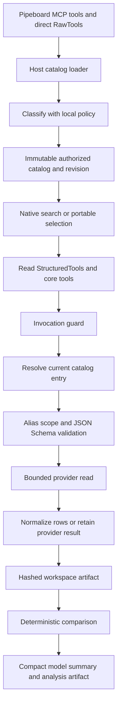

# Authorized Tool Catalog, Reads, and Analysis Artifacts

The model does not receive a provider's raw tool catalog as authority. Host code classifies untrusted Pipeboard MCP metadata and direct-adapter declarations into an immutable, revision-hashed catalog, exposes only admitted reads, and rechecks that authority at invocation. Provider payloads, model output, MCP metadata, remote content, and files remain untrusted input throughout this pipeline. This is the read-side complement to the governed mutation flow in [Governed Write Protocol](/openwiki/concepts/governed-write-protocol.md); it does not restate paid-media judgment from the paid-media wiki skill.

## Lifecycle and trust boundaries

This diagram shows that selection is a context-management step, while the current host catalog and dispatcher remain the authority for a provider read.

### Sources and loading

`load_catalog` selects the process catalog. With neither a Pipeboard token nor configured direct adapters it returns the fixture catalog with no live providers. With direct credentials but no Pipeboard token it combines fixture raw tools with direct raw tools and routes reads through a composite provider. With a Pipeboard token it loads the reviewed write-policy admissions, refreshes a Pipeboard loader, and combines Pipeboard and direct reads; the Pipeboard write adapter remains separate from reads. [catalog.py](repo://src/paid_media_agent/runtime/catalog.py#L39-L95)

A `PipeboardCatalogLoader` creates MCP Streamable HTTP connection maps in host code, including its bearer token only in the connection headers. On refresh it requests tools for each configured platform, logs and skips a platform whose load fails, converts each LangChain tool's JSON schema and selected metadata annotations to `RawTool`, and builds the authorized catalog alongside an exact-name map of the loaded tools. The loader must be refreshed before `current()` can be used. [pipeboard.py](repo://src/paid_media_agent/tools/pipeboard.py#L35-L68) [pipeboard.py](repo://src/paid_media_agent/tools/pipeboard.py#L71-L124)

The current live implementation is loaded once per process; `current()` serves that loaded snapshot, so restarting is required to pick up external catalog changes. The documented lifecycle calls for bounded caching and refresh after authentication or schema failures and unknown-tool responses; treat any selection-time snapshot as non-authoritative at execution. [pipeboard.py](repo://src/paid_media_agent/tools/pipeboard.py#L93-L97) [tools-and-context.md](repo://docs/architecture/tools-and-context.md#L3-L13) [catalog.py](repo://src/paid_media_agent/tools/catalog.py#L302-L305)

### Admission policy and catalog identity

`LocalPolicy` is repository-owned and identifies enabled platforms, their accepted provider account-argument names, denied name patterns, and explicitly admitted qualified mutation names. A skill edit cannot change that policy. A raw tool is deny-by-default: unknown or disabled platform, malformed name or object schema, missing read-only metadata, unsafe names, destructive hints, and missing account scope are denied. A `readOnlyHint=true` tool becomes a read only when it has a recognized account argument; a non-read-only tool becomes a mutation only when it is non-destructive, account-scoped, and explicitly admitted. [catalog.py](repo://src/paid_media_agent/tools/catalog.py#L70-L111) [catalog.py](repo://src/paid_media_agent/tools/catalog.py#L122-L209)

Every recognized raw tool remains an entry with an explicit decision; duplicate qualified names are marked denied. Entries are sorted, descriptions are bounded, and the catalog revision hashes each entry's qualified name, schema hash, class, decision reason, and description. Therefore a schema change changes the entry schema hash and catalog revision. `search()` lists only read entries, never denied or mutation entries. [catalog.py](repo://src/paid_media_agent/tools/catalog.py#L216-L254) [catalog.py](repo://src/paid_media_agent/tools/catalog.py#L257-L299)

## Model surface, discovery, and invocation guard

The agent assembly produces one `StructuredTool` per authorized read plus core tools such as account listing, discovery, deterministic comparison, summary, and report rendering. Mutation and denied catalog entries are never bound as platform tools. The allowed surface includes those assembled tools and approved filesystem tools, while Deep Agents built-ins `task`, `execute`, and `delete` are hidden. [assembly.py](repo://src/paid_media_agent/assembly.py#L202-L227) [reads.py](repo://src/paid_media_agent/tools/reads.py#L341-L385) [authorization.py](repo://src/paid_media_agent/middleware/authorization.py#L21-L34)

Tool selection reduces context, not authorization. Registered compatible models use provider-native deferred search unless a custom base URL is used; unregistered, proxy, and non-native cases use `LLMToolSelectorMiddleware` through the portable wrapper; scripted models bind all tools. If portable selection names an invalid tool, the wrapper retries that turn with only always-included core tools rather than exposing a wider set. Both strategies are constructed from the same authorized platform-read names. [tool_selection.py](repo://src/paid_media_agent/middleware/tool_selection.py#L135-L177) [tool_selection.py](repo://src/paid_media_agent/middleware/tool_selection.py#L180-L218) [tool_selection.py](repo://src/paid_media_agent/middleware/tool_selection.py#L272-L290)

`InvocationGuardMiddleware` filters model-request tools to the allowed surface and, immediately before a tool call, returns an error ToolMessage for a name outside it. For a catalog name it also rejects anything whose current classification is not `READ`, directing mutations to the governed write tools. This protects against hallucinated names, framework-registered extras, and a stale selected mutation. [authorization.py](repo://src/paid_media_agent/middleware/authorization.py#L47-L103)

## Read dispatch: current authority, aliases, and schemas

A model-facing read schema removes the provider account argument, makes `account_alias` required, disables additional properties, and includes an alias enum only when there are at most 20 aliases. The host, rather than the model, resolves that alias to the provider account ID. [reads.py](repo://src/paid_media_agent/tools/reads.py#L99-L116)

`ReadDispatcher` is the sole model-to-provider read path. It resolves the qualified name in the *current* catalog, requires it still be a read, and rejects a tool whose bound selection schema hash no longer matches. It then requires a known alias for the entry's platform, rejects an explicitly supplied provider account argument or any argument containing a configured raw provider ID, injects the host-owned ID, and validates the resulting arguments against the original provider JSON Schema. [reads.py](repo://src/paid_media_agent/tools/reads.py#L119-L185)

The dispatcher bounds the provider call by timeout, sends storage and normalization work off the event loop, and retains a bounded in-memory audit record containing the qualified tool name, alias, catalog revision, policy decision, and artifact ID—not the raw account ID. A Pipeboard read provider can call only a tool present in the loader's current exact-name map; MCP invocation normalizes structured or textual tool content into an object and turns timeouts and provider errors into bounded provider failures. [reads.py](repo://src/paid_media_agent/tools/reads.py#L187-L214) [pipeboard.py](repo://src/paid_media_agent/tools/pipeboard.py#L130-L183)

## Normalized rows and artifacts

When a result has nonempty `rows`, the dispatcher normalizes it to `PerformanceRow` data. Normalization requires a parseable date, platform-recognized spend field, and entity identifier; it converts spend from platform units, preserves unknown metrics as missing, picks grain-aware identifiers and names, and marks incomplete windows and missing conversion fields with quality flags. A normalization failure rejects the read rather than presenting malformed performance data as a valid analysis input. [normalize.py](repo://src/paid_media_agent/tools/normalize.py#L81-L165) [reads.py](repo://src/paid_media_agent/tools/reads.py#L234-L259)

Normalized rows are persisted as a versioned `performance_rows` artifact with provider totals, missing fields, requested and actual windows, quality flags, platform, alias, grain, tool name, and catalog revision. Non-row results are instead written as versioned `provider_result` artifacts. In both cases the model receives a compact `ReadResult` with artifact identity, provenance, bounded preview, and a note to use deterministic computation rather than preview arithmetic. [reads.py](repo://src/paid_media_agent/tools/reads.py#L75-L96) [reads.py](repo://src/paid_media_agent/tools/reads.py#L262-L324)

`ArtifactStore` writes JSON beneath workspace `analysis` or `out` directories with an opaque random ID and a SHA-256 hash of canonical serialized payload content. Metadata captures byte size, creation time, schema version, row count, source and window provenance, quality flags, tool name, and catalog revision. Reads validate ID and workspace containment, reconstruct metadata, and reject content whose recomputed hash differs. [artifacts.py](repo://src/paid_media_agent/tools/artifacts.py#L17-L55) [artifacts.py](repo://src/paid_media_agent/tools/artifacts.py#L61-L150)

## Deterministic analysis and safe extension

`compare_periods` accepts only `performance_rows` artifacts, equal-length current and previous windows, and at least one artifact. It rejects incomplete coverage and empty windows rather than interpreting missing data as zero, derives platform comparisons in code, stores a versioned analysis artifact, and returns a compact summary. A cross-platform total is suppressed when a requested source is unavailable, currencies differ, either window is incomplete, metrics are missing, or platform windows differ. [compare_periods.py](repo://src/paid_media_agent/tools/compare_periods.py#L43-L124) [compute.py](repo://src/paid_media_agent/tools/compute.py#L301-L341)

To add a platform or read capability safely, publish an account-scoped `RawTool` with a valid object schema and `readOnlyHint=true`, add the platform and account argument to the local policy when needed, route execution through a `ReadProvider`, and make normalization support its source fields and units. Do not bind raw MCP tools directly, infer a mutation from prose, or move arithmetic into model reasoning. For implementation boundaries and assembly ordering, see [Shared Agent Assembly and Runtime Boundaries](/openwiki/architecture/shared-agent-runtime.md); for provider integration context, see [Advertising Platforms and Pipeboard](/openwiki/integrations/advertising-platforms-and-pipeboard.md).

## Focused verification

The catalog-policy tests cover fail-closed metadata, name, platform, schema, account-scope, destructive, admission, search, and revision behavior. Read-path tests cover hidden provider IDs, alias platform scope, JSON Schema enforcement, unknown/non-read/stale calls, and no raw IDs in audit. Graph contracts verify that hallucinated hidden or mutation calls are denied and mutations are not bound, while selection contracts verify native deferred loading, portable bounded selection, and invalid-selection fallback. [test_catalog_policy.py](repo://tests/unit/test_catalog_policy.py#L30-L118) [test_reads_and_surfaces.py](repo://tests/unit/test_reads_and_surfaces.py#L40-L86) [test_read_path_graph.py](repo://tests/contract/test_read_path_graph.py#L15-L110) [test_selection_matrix.py](repo://tests/contract/test_selection_matrix.py#L59-L190)
