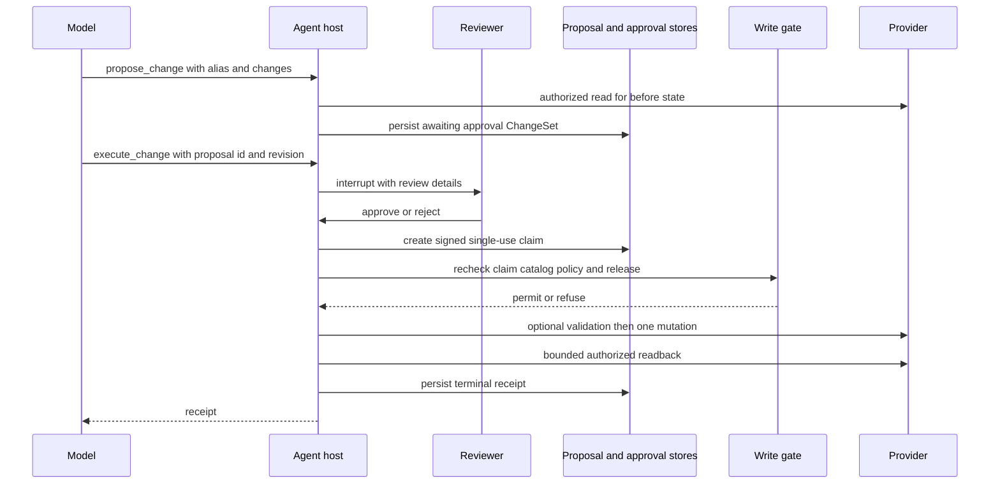
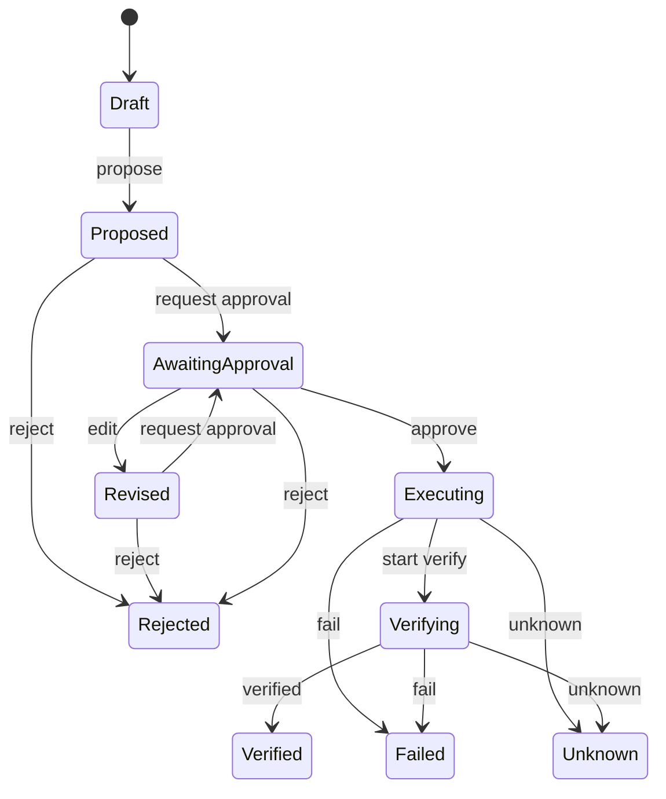

# Governed Change and Approval Protocol

A provider mutation is not a model-bound tool. The model can discover admitted operations, stage a proposal, inspect it, and request execution; the host owns proposal persistence, human approval, identity and signature verification, release checks, the single mutation attempt, and read-only reconciliation. The resulting protocol makes the reviewed `ChangeSet`, rather than a conversational summary or an approval-card payload, the authority for both review and execution. [write_tools.py](repo://src/paid_media_agent/tools/write_tools.py#L121-L239) [writes.py](repo://src/paid_media_agent/tools/writes.py#L269-L447)

This is the mutation-side companion to [Authorized Tool Catalog, Reads, and Analysis Artifacts](/openwiki/concepts/authorized-catalog-and-read-data.md). It relies on that catalog to classify a tool as an authorized mutation or read and on its account aliases to keep provider account IDs host-owned.

## Protocol and ownership boundaries

This diagram shows the host-owned path from staging through approval, gated execution, and readback; the model never receives a direct provider mutation binding.

The shared assembly creates `ProposalService` and `WriteExecutor` from runtime-owned repositories, providers, policy, accounts, and signer. It includes the four governed write tools only in conversation mode and registers an interrupt only for `execute_change`; raw catalog mutation entries are not platform tools. The interrupt predicate requests review only when the UUID belongs to the active thread—malformed, unknown, or foreign-thread calls proceed to a refusal rather than presenting an unexecutable approval request. [assembly.py](repo://src/paid_media_agent/assembly.py#L115-L145) [assembly.py](repo://src/paid_media_agent/assembly.py#L202-L227) [assembly.py](repo://src/paid_media_agent/assembly.py#L251-L285) [write_tools.py](repo://src/paid_media_agent/tools/write_tools.py#L74-L118)

`propose_change` accepts an account alias, admitted qualified tool name, target reference, allowed field-to-value changes, reason, and optional measurement and reversal plans. It resolves the alias, injects the provider account ID, validates canonical arguments against the mutation schema, and obtains the before values using the operation's authorized readback tool. Empty changes, unknown aliases, platform mismatch, uneditable fields, invalid target, schema failure, or an unreadable target deny staging. [write_tools.py](repo://src/paid_media_agent/tools/write_tools.py#L30-L44) [writes.py](repo://src/paid_media_agent/tools/writes.py#L325-L386) [writes.py](repo://src/paid_media_agent/tools/writes.py#L388-L447)

## Persisted proposal, state, and integrity

`ChangeSet` is an immutable canonical proposal with its identity and revision, platform and opaque account reference, tool and target, host-built canonical arguments, before and after field values, rationale and plans, risk, catalog revision, requester and thread, schema hash, policy digest, and derived risk flags. A `ProposalRecord` adds current state, append-only textual history, and a random opaque `routing_id`; surfaces use that routing ID rather than carrying executable arguments. [proposals.py](repo://src/paid_media_agent/domain/proposals.py#L85-L131) [proposals.py](repo://src/paid_media_agent/domain/proposals.py#L201-L210) [writes.py](repo://src/paid_media_agent/tools/writes.py#L401-L447)

The payload digest is SHA-256 of canonical JSON over proposal ID, revision, platform, account, tool, target, canonical arguments, before/after values, catalog revision, schema hash, policy digest, requester, and thread. Presentation-only text is intentionally excluded. This binds what will execute to the persisted proposal while allowing review wording to change without changing authority. [proposals.py](repo://src/paid_media_agent/domain/proposals.py#L114-L145)

This state machine is enforced transition-by-transition; terminal states have no outgoing transitions in the defined transition table.

An edit is only permitted while awaiting approval, retains the same proposed field set, increments revision, recomputes canonical arguments/digest/schema hash/policy digest/risk flags, and generates a new routing ID before returning to `awaiting_approval`. An earlier claim targets its old revision and cannot authorize the revised proposal. [proposals.py](repo://src/paid_media_agent/domain/proposals.py#L44-L59) [writes.py](repo://src/paid_media_agent/tools/writes.py#L456-L495) [writes.py](repo://src/paid_media_agent/tools/writes.py#L612-L628)

The repository contracts support save/get, lookup by opaque routing ID, and thread listing for proposal records; approval lookup is scoped to proposal and revision and its `mark_used` operation is explicitly first-consumer-wins; receipts are saved and retrieved by proposal. The shipped in-memory implementations are for tests and the local demo, not a production persistence profile. In a durable deployment, implementations must preserve the atomic single-use semantics of `mark_used` across concurrent executors. [interfaces.py](repo://src/paid_media_agent/persistence/interfaces.py#L11-L35) [memory.py](repo://src/paid_media_agent/persistence/memory.py#L1-L64)

## Approval as a host-created capability

Only `ProposalService.approve` creates an `ApprovalClaim`. It first requires `awaiting_approval`, applies the configured approver allowlist and self-approval setting, verifies the persisted proposal's digest, then signs a new claim with an expiry determined by `ttl_seconds`. The signer uses HMAC-SHA256 and requires a key of at least 16 bytes; the signing key remains in the host configuration. [writes.py](repo://src/paid_media_agent/tools/writes.py#L128-L160) [writes.py](repo://src/paid_media_agent/tools/writes.py#L512-L549)

The signed material binds the claim ID, proposal ID and revision, payload digest, account and tool, requester and approver identities, approval and expiry times, and nonce. Immediately before execution, the executor verifies that signature; matching proposal/revision/digest/scope/requester; and expiry (including a small future-issued-time tolerance). It obtains the latest unused claim for that exact revision and consumes it before changing the proposal to `executing`; a failed consume is a replay refusal. [proposals.py](repo://src/paid_media_agent/domain/proposals.py#L148-L181) [writes.py](repo://src/paid_media_agent/tools/writes.py#L612-L628) [writes.py](repo://src/paid_media_agent/tools/writes.py#L753-L788)

A surface approval is therefore an identity-bearing request to the host, not a signed payload supplied by a client. For example, the tool resume path first confirms thread ownership and the displayed revision; only then can it create the claim using the runtime caller identity if no surface has already created one. [write_tools.py](repo://src/paid_media_agent/tools/write_tools.py#L155-L189)

## Admission policy and release gates

The reviewed mutation set is a TOML data file. A row must be explicitly `admitted = true`; validation against the current catalog keeps it only when the named tool is an authorized mutation, target/editable/optional validation and idempotency fields occur in its schema, its readback tool is an authorized read, and the readback mapping covers exactly the editable fields. Invalid, unavailable, or unadmitted rows become `PolicyIssue`s and are omitted from the effective `WritePolicy`, so removing a row makes that operation unproposable. [write_policy.py](repo://src/paid_media_agent/tools/write_policy.py#L70-L109) [write_policy.py](repo://src/paid_media_agent/tools/write_policy.py#L112-L164) [write-policy.example.toml](repo://config/write-policy.example.toml#L1-L15)

At staging, the service separately confirms that the current catalog entry is a mutation and that a reviewed effective policy operation exists. At execution, it rechecks the mutation/readback authorization, the proposal-time schema hash, policy digest, current JSON Schema validity of canonical arguments, and account alias resolution to the same injected provider account. A catalog/schema change produces `stale_catalog`; a changed policy row produces `stale_policy`, preventing a previously reviewed proposal from silently adapting. [writes.py](repo://src/paid_media_agent/tools/writes.py#L325-L335) [writes.py](repo://src/paid_media_agent/tools/writes.py#L630-L661)

`WriteGate` checks the kill switch first for every provider, including fakes. A fake provider otherwise passes without live-release settings; a live provider additionally requires writes enabled, a configured catalog revision equal to the current one, and that the exact tool be in the canary allowlist. Gate failure rejects before any provider call. [writes.py](repo://src/paid_media_agent/tools/writes.py#L169-L226) [writes.py](repo://src/paid_media_agent/tools/writes.py#L767-L782)

For live canaries, keep writes disabled by default. After read-only schema review and policy validation, pin `PAID_MEDIA_LIVE_WRITE_CATALOG_REVISION`, set a one-tool `PAID_MEDIA_LIVE_WRITE_CANARY_TOOLS` allowlist, and set `PAID_MEDIA_WRITES_ENABLED=true`, then restart. Creating the file at `PAID_MEDIA_KILL_SWITCH_PATH` stops pending execution without a restart. The runbook requires a new proposal for reversal or any subsequent action; no approval is replayed. [live-write-runbook.md](repo://docs/operations/live-write-runbook.md#L1-L19) [live-write-runbook.md](repo://docs/operations/live-write-runbook.md#L21-L50) [live-write-runbook.md](repo://docs/operations/live-write-runbook.md#L52-L62)

The live `PipeboardWriteProvider` is an exact-name adapter reachable only through the executor and gate; it refuses a missing loaded tool and refuses to mutate unless `readOnlyHint` is exactly `false`. [pipeboard.py](repo://src/paid_media_agent/tools/pipeboard.py#L186-L207)

## One attempt, validation, readback, and receipts

After all preconditions and claim consumption succeed, `WriteExecutor` may send a provider-side validation call when the policy names `validate_only_arg`; validation failure ends `failed` with `mutation_attempted=false`. It derives a deterministic provider idempotency value from proposal ID and revision only when the operation declares `idempotency_arg`. The real mutation is then called at most once under a timeout—there is no mutation retry path. [writes.py](repo://src/paid_media_agent/tools/writes.py#L784-L817) [writes.py](repo://src/paid_media_agent/tools/writes.py#L818-L844)

Readback uses only the authorized read provider, preserves account/target arguments from the canonical proposal, and is bounded by both configured attempt count (default three) and wall-clock budget (default 20 seconds). It compares numbers numerically where possible and otherwise as strings. Matching all after values yields `verified`; a final before-value match yields `failed`; read failure, an intermediate/different value, or exhausted proof budget yields `unknown`. A timeout after submission is reconciled by this same readback and never triggers a second mutation. [writes.py](repo://src/paid_media_agent/tools/writes.py#L67-L69) [writes.py](repo://src/paid_media_agent/tools/writes.py#L259-L266) [writes.py](repo://src/paid_media_agent/tools/writes.py#L692-L739) [writes.py](repo://src/paid_media_agent/tools/writes.py#L829-L891)

Every execution outcome is persisted as a `WriteReceipt` with proposal and revision, one of `verified`, `rejected`, `failed`, or `unknown`, whether a mutation was attempted, whether the provider acknowledged it, an optional provider operation reference, observed state, check time, catalog revision, reason, and readback count. Thus acknowledgement is not proof: a timed-out request may be verified by readback while still reporting `provider_acknowledged=false`. [proposals.py](repo://src/paid_media_agent/domain/proposals.py#L16-L16) [proposals.py](repo://src/paid_media_agent/domain/proposals.py#L184-L198) [writes.py](repo://src/paid_media_agent/tools/writes.py#L663-L690) [writes.py](repo://src/paid_media_agent/tools/writes.py#L846-L891)

## Change and verification guidance

To add an operation safely, first ensure catalog admission as an account-scoped non-destructive mutation, then add a reviewed policy row with exact schema field names, risk, readback tool/field mapping, and only schema-supported validation or idempotency arguments. Validate it against the live catalog, perform a read-only integration check, and release it as a single-tool reversible canary. Do not expose the provider adapter or raw mutation tool to the model, weaken the claim bindings, or add mutation retry logic. [runtime/catalog.py](repo://src/paid_media_agent/runtime/catalog.py#L39-L95) [write_policy.py](repo://src/paid_media_agent/tools/write_policy.py#L106-L164) [live-write-runbook.md](repo://docs/operations/live-write-runbook.md#L21-L37)

Focused contract coverage demonstrates the critical failure boundaries: the graph pauses before any provider call, valid approval results in one verified mutation, tampering and revisions are refused, expired or replayed claims cannot execute, foreign accounts/fields/tools cannot be proposed, and stale schemas cannot execute. It also covers timeout-after-commit readback verification, timeout-without-commit failure, and unprovable readback becoming `unknown`, all with one mutation call. [test_write_flows_graph.py](repo://tests/contract/test_write_flows_graph.py#L45-L71) [test_write_flows_graph.py](repo://tests/contract/test_write_flows_graph.py#L106-L187) [test_write_flows_graph.py](repo://tests/contract/test_write_flows_graph.py#L208-L258) [test_write_flows_graph.py](repo://tests/contract/test_write_flows_graph.py#L281-L307)

Gate and policy tests additionally prove fail-closed policy validation, the gate matrix and kill switch, policy drift rejection, unknown/foreign proposal IDs not interrupting reviewers, validation-before-mutation behavior, and honest acknowledgement reporting. [test_write_policy_and_gate.py](repo://tests/unit/test_write_policy_and_gate.py#L21-L85) [test_write_policy_and_gate.py](repo://tests/unit/test_write_policy_and_gate.py#L104-L134) [test_live_write_gates.py](repo://tests/contract/test_live_write_gates.py#L155-L195) [test_live_write_gates.py](repo://tests/contract/test_live_write_gates.py#L198-L303)
