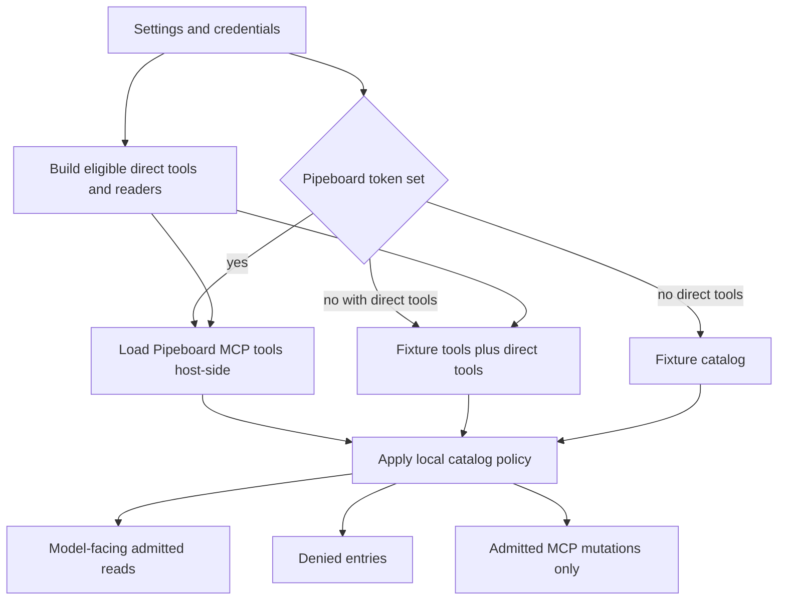

Pipeboard and the direct adapters are two provider-transport implementations behind one host-owned authorization model. Pipeboard supplies authenticated MCP tools for Google Ads, Meta Ads, and Reddit Ads; LinkedIn Ads, X Ads, and OpenAI Ads are direct HTTP adapters for platforms outside that path. The model is never given a provider client, a credential, or an unconstrained provider tool: the host loads tools, classifies them, exposes only admitted reads, and resolves an account alias to the provider identifier immediately before a call. [README.md#L92-L103](repo://README.md#L92-L103) [src/paid_media_agent/tools/catalog.py#L216-L254](repo://src/paid_media_agent/tools/catalog.py#L216-L254) [src/paid_media_agent/tools/reads.py#L119-L185](repo://src/paid_media_agent/tools/reads.py#L119-L185)

## Integration boundary

### Pipeboard MCP

A configured Pipeboard token selects the live path. `PipeboardCatalogLoader` builds a Streamable HTTP connection for each configured Google Ads, Meta Ads, and Reddit Ads endpoint, placing the bearer token in request headers held by the host-side client configuration. It fetches each server's LangChain tools, copies schemas and recognized MCP annotations into `RawTool` values, and indexes the actual callable tools by qualified platform/name. Individual endpoint failures are logged after sanitization and do not prevent the remaining endpoints from contributing tools. [src/paid_media_agent/config.py#L127-L141](repo://src/paid_media_agent/config.py#L127-L141) [src/paid_media_agent/tools/pipeboard.py#L35-L68](repo://src/paid_media_agent/tools/pipeboard.py#L35-L68) [src/paid_media_agent/tools/pipeboard.py#L99-L124](repo://src/paid_media_agent/tools/pipeboard.py#L99-L124)

The loader is initialized once, and `current()` is unavailable until `refresh()` has completed; its documented lifecycle is one catalog load per process, so a restart is required to pick up provider catalog changes. A Pipeboard read resolves the already-loaded tool by qualified name, invokes it as a tool call under a timeout, and converts structured MCP content or JSON/text content into a payload. Errors and timeouts are surfaced as sanitized provider failures. [src/paid_media_agent/tools/pipeboard.py#L71-L97](repo://src/paid_media_agent/tools/pipeboard.py#L71-L97) [src/paid_media_agent/tools/pipeboard.py#L130-L183](repo://src/paid_media_agent/tools/pipeboard.py#L130-L183)

### Direct adapters

The direct integration module deliberately contains read providers only—there is no direct write provider or direct mutation tool. It contributes raw tools through the same catalog classifier and routes an admitted direct read by `entry.platform`; if neither a platform-specific provider nor a default exists, it fails rather than falling through to an arbitrary transport. Adding a direct write integration therefore requires a separate designed path, including reviewed policy rows and a canary, rather than merely adding an HTTP method. [src/paid_media_agent/tools/direct/__init__.py#L1-L6](repo://src/paid_media_agent/tools/direct/__init__.py#L1-L6) [src/paid_media_agent/tools/direct/__init__.py#L24-L63](repo://src/paid_media_agent/tools/direct/__init__.py#L24-L63)

Direct-platform admission is credential-driven:

- LinkedIn is enabled when an access token is configured; refresh credentials are optional and are used only for one retry after a 401 response.
- X requires its consumer key and secret plus access token and secret as a complete set, and signs requests with OAuth 1.0a HMAC-SHA1.
- OpenAI Ads is enabled when its API key is configured and uses bearer authentication.

Empty secret settings are converted to `None`; incomplete X credentials consequently do not add X tools or a provider. Credentials remain `SecretStr` values in settings and are not returned by the catalog or status paths. [src/paid_media_agent/config.py#L132-L141](repo://src/paid_media_agent/config.py#L169-L186) [src/paid_media_agent/config.py#L214-L228](repo://src/paid_media_agent/config.py#L214-L228) [src/paid_media_agent/tools/direct/linkedin.py#L121-L180](repo://src/paid_media_agent/tools/direct/linkedin.py#L121-L180) [src/paid_media_agent/tools/direct/x_ads.py#L109-L135](repo://src/paid_media_agent/tools/direct/x_ads.py#L109-L135) [src/paid_media_agent/tools/direct/openai_ads.py#L92-L123](repo://src/paid_media_agent/tools/direct/openai_ads.py#L92-L123)

Each direct adapter declares account listing, campaign listing, and daily performance reads. LinkedIn additionally offers creative-level performance; X and OpenAI Ads offer ad-group performance. All these declarations have `readOnlyHint: true` and a direct source endpoint. Account-listing entries intentionally have no account argument and therefore are denied from the model-facing read catalog, while scoped campaign and performance entries can be admitted. [src/paid_media_agent/tools/direct/linkedin.py#L48-L101](repo://src/paid_media_agent/tools/direct/linkedin.py#L48-L101) [src/paid_media_agent/tools/direct/x_ads.py#L49-L102](repo://src/paid_media_agent/tools/direct/x_ads.py#L49-L102) [src/paid_media_agent/tools/direct/openai_ads.py#L42-L89](repo://src/paid_media_agent/tools/direct/openai_ads.py#L42-L89) [tests/unit/test_direct_adapters.py#L42-L53](repo://tests/unit/test_direct_adapters.py#L42-L53)

## Catalog composition and admission

`load_catalog()` always builds the direct tool/provider set first. With no Pipeboard token and no direct credentials, it returns the fixture catalog with no live providers. With direct credentials but no Pipeboard token, it combines fixture Pipeboard tools with direct tools and uses a composite reader with no write provider. With a Pipeboard token, it refreshes the live MCP catalog, appends direct tools, and pairs the composite reader with the Pipeboard-only write provider. Thus direct credentials can make direct reads live but never make the overall runtime live for writes. [src/paid_media_agent/runtime/catalog.py#L39-L94](repo://src/paid_media_agent/runtime/catalog.py#L39-L94)

This shows catalog composition before model exposure; provider tools are classified by host code rather than trusted on discovery alone.

The local policy is deny-by-default. A tool must name a recognized platform, have a valid object schema and tool name, avoid prohibited mutation/raw/delete/remove/purge name patterns, carry a boolean `readOnlyHint`, and have a configured account argument to become a read. A non-read-only tool also needs `destructiveHint` not true, account scope, and an exact qualified name in `admitted_mutations` to become a mutation; otherwise it is denied. Unknown platforms, malformed metadata or schema, duplicate qualified names, and unadmitted mutations remain catalog entries marked denied. The immutable catalog revision hashes the ordered name, schema hash, classification, reason, and description, making a changed provider schema/classification observable. [src/paid_media_agent/tools/catalog.py#L77-L111](repo://src/paid_media_agent/tools/catalog.py#L77-L111) [src/paid_media_agent/tools/catalog.py#L122-L209](repo://src/paid_media_agent/tools/catalog.py#L122-L209) [src/paid_media_agent/tools/catalog.py#L257-L299](repo://src/paid_media_agent/tools/catalog.py#L257-L299)

Only `read_entries()` participate in catalog search and receive model-facing wrappers. The read dispatcher re-resolves the qualified name against the current catalog and rejects absent, non-read, or stale-schema selections before contacting a provider. This prevents a selection-time snapshot or tool-name guess from becoming authority. [src/paid_media_agent/tools/catalog.py#L231-L254](repo://src/paid_media_agent/tools/catalog.py#L231-L254) [src/paid_media_agent/tools/reads.py#L142-L157](repo://src/paid_media_agent/tools/reads.py#L142-L157) [src/paid_media_agent/tools/reads.py#L341-L345](repo://src/paid_media_agent/tools/reads.py#L341-L345)

## Account discovery and scoped execution

Account discovery is an administrative, host-side operation, not a model read. `paid-media-agent accounts discover --json` loads the catalog, finds read-only account/customer listing tools that have no account argument, invokes direct listings through their direct provider and Pipeboard listings through the loaded MCP tool, extracts candidate identifiers with display metadata, and annotates already mapped entries. Failures are retained in the action result while discovery continues. If no live integration is configured, it reports fixture accounts instead. Do not put provider identifiers in prompts, documentation, or model tool arguments. [src/paid_media_agent/admin/actions.py#L381-L419](repo://src/paid_media_agent/admin/actions.py#L381-L419) [src/paid_media_agent/admin/actions.py#L433-L513](repo://src/paid_media_agent/admin/actions.py#L433-L513)

An operator then adds a validated `AccountBinding`: a public alias, platform, provider account ID, currency, and timezone. The registry explicitly treats the alias as model-visible while retaining provider IDs host-side. At execution, the dispatcher requires an alias, verifies that it exists and belongs to the target platform, rejects supplied or embedded known raw account IDs, injects the binding's provider ID into the provider schema's account argument, then validates the final arguments against that schema. [src/paid_media_agent/config.py#L52-L81](repo://src/paid_media_agent/config.py#L52-L81) [src/paid_media_agent/admin/actions.py#L534-L547](repo://src/paid_media_agent/admin/actions.py#L534-L547) [src/paid_media_agent/tools/reads.py#L159-L185](repo://src/paid_media_agent/tools/reads.py#L159-L185)

After a successful read, rows are normalized using binding currency/timezone where the provider does not provide them, written as artifacts with tool name and catalog revision, and annotated for incomplete windows or missing fields. Non-row responses are also artifacted as bounded provider results. This is the common downstream data boundary for both MCP and direct transport. [src/paid_media_agent/tools/reads.py#L216-L324](repo://src/paid_media_agent/tools/reads.py#L216-L324)

## Live mutation constraint

The sole live mutation adapter is `PipeboardWriteProvider`. It refuses a tool unless it is present in the currently loaded MCP map and its catalog entry explicitly has `readOnlyHint == false`; it normalizes a provider operation identifier into `operation_ref` when possible. Its class documentation further states that it is reachable only through the governed `WriteExecutor` and `WriteGate`. Direct adapters cannot reach this path because catalog loading supplies no direct write provider. [src/paid_media_agent/tools/pipeboard.py#L186-L207](repo://src/paid_media_agent/tools/pipeboard.py#L186-L207) [src/paid_media_agent/runtime/catalog.py#L68-L94](repo://src/paid_media_agent/runtime/catalog.py#L68-L94)

Even an admitted Pipeboard mutation is not automatically executable. The runtime write gate receives the writes-enabled flag, fake-provider status, kill-switch path, released catalog revision, canary names, and a function for the current catalog revision. The managed profile substitutes live read/write providers only when `LoadedCatalog.live` is true; fixture and direct-only configurations retain the fake profile behavior rather than acquiring a live writer. See [Governed Write Protocol](/openwiki/concepts/governed-write-protocol.md) for proposal, approval, gate, and receipt semantics. [src/paid_media_agent/runtime/profiles.py#L60-L72](repo://src/paid_media_agent/runtime/profiles.py#L60-L72) [src/paid_media_agent/runtime/mda.py#L45-L66](repo://src/paid_media_agent/runtime/mda.py#L45-L66)

## Operational checks and focused tests

Configure credentials only in the deployment/local environment; do not commit them. `paid-media-agent test pipeboard --json` warns and reports the fixture catalog when no token is set, otherwise loads the live catalog and reports read, admitted-mutation, and denied counts, including a warning for absent or empty Pipeboard platforms. [src/paid_media_agent/admin/actions.py#L345-L378](repo://src/paid_media_agent/admin/actions.py#L345-L378)

The most useful regression coverage is deliberately layered:

- The opt-in live test runs only with `PAID_MEDIA_LIVE_TESTS=1`, verifies the Pipeboard catalog source, asserts that no mutations are admitted before release review, and requires every admitted read to have both `readOnlyHint` and account scope. [tests/integration/test_live_readonly.py#L11-L30](repo://tests/integration/test_live_readonly.py#L11-L30)
- Direct-adapter tests verify credential completeness and catalog classification, LinkedIn refresh-on-401 behavior and normalized analytics, OAuth signing plus X window/ID chunk limits, OpenAI insight request fields, platform dispatch, and that error messages do not contain credentials. [tests/unit/test_direct_adapters.py#L42-L59](repo://tests/unit/test_direct_adapters.py#L42-L59) [tests/unit/test_direct_adapters.py#L62-L155](repo://tests/unit/test_direct_adapters.py#L62-L155) [tests/unit/test_direct_adapters.py#L186-L259](repo://tests/unit/test_direct_adapters.py#L186-L259) [tests/unit/test_direct_adapters.py#L262-L344](repo://tests/unit/test_direct_adapters.py#L262-L344)

For the broader operational sequence and fixture-first setup, see [Local Setup and Managed Deployment](/openwiki/operations/local-setup-and-managed-deployment.md); for how admitted reads become analysis inputs, see [Analysis and Reporting](/openwiki/workflows/analysis-and-reporting.md).
