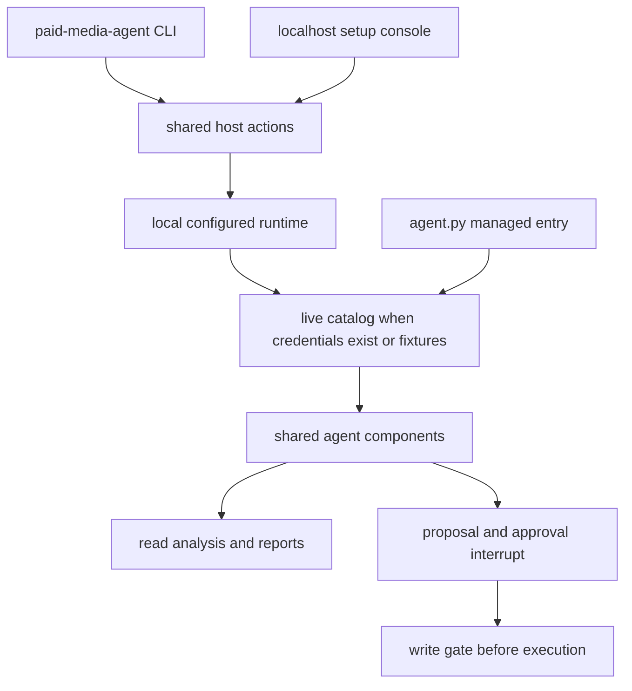

## Scope and operating boundary

This repository's `main` branch is oriented around **Managed Deep Agents (MDA)**. The thin `agent.py` entrypoint builds the configured shared runtime and gives its model, tools, middleware, and approval interrupts to `define_deep_agent`; the MDA runtime supplies the surrounding managed service. Self-hosting is explicitly not a `main`-branch operating model. [^mda-entry] [^self-hosting]

Start with the fixture path. It needs neither secrets nor a network connection: `paid-media-agent demo` constructs a scripted model with self-approval enabled only for that demo and runs it through the real graph. `--with-proposal` additionally exercises the governed fake-write path and shows its persisted proposal/receipt output. [^demo]

```bash
uv sync --all-extras --dev
uv run paid-media-agent demo --with-proposal
```

Python 3.11 or newer is required. `uv sync` is sufficient for the basic fixture demo; the broader sync installs development and optional provider/report dependencies. [^project]

### Entry-point relationship



*CLI and console share host actions; local and managed paths assemble the same configured profile, while execution remains gated.*

The CLI invokes `apply_env_file()` before every command. That loader exports only known configuration keys from the project `.env`; its own previously exported blank keys are removed, while unknown keys are not exported. It writes validated values while retaining unrelated lines/comments and sets `.env` to mode `0600` when needed. Treat `.env` as local secret material and do not put secrets in configuration examples, TOML, fixtures, or reports. [^cli-env] [^envfile]

## Configuration and local onboarding

`Settings` is the typed boundary for environment configuration. In particular, a model must be written as `provider:model` (a bare model is rejected); timeouts, model-call limits, workspace, fixture anchor, account path, write controls, direct-platform credentials, and sandbox options all have typed defaults or validation. Secret-bearing settings use `SecretStr`. [^settings]

Use the setup console when interactive onboarding is preferable:

```bash
uv run paid-media-agent setup
# use --no-open when a browser must not be opened automatically
```

The console binds Uvicorn to `127.0.0.1`, opens a URL containing a newly generated per-run token in the fragment, and stops child processes when it exits. Requests are restricted to loopback host headers and API calls require the token in `x-admin-token`; responses use a restrictive CSP, `no-store`, and no-referrer headers. It is therefore a local onboarding tool, not an admin service to expose on a network. [^console-security]

Both surfaces use typed `ActionResult` responses, and the command implementations delegate to the same `admin.actions` functions that serve the console. Prefer `--json` for action-oriented automation; failures emitted through `_emit` return exit status 1. [^cli-actions] [^action-result]

Useful progression:

1. Run the fixture demo before configuring any provider.
2. Set a provider-qualified model and its key in `.env`, then run `paid-media-agent test model --json`. The test checks the provider package/key and makes a short call, returning only a preview rather than the secret. [^model-test]
3. Connect live read sources only when required, discover accounts, and map a public alias for each selected account.
4. Add the organization profile before relying on recommendations.
5. Run `paid-media-agent doctor` and, before deployment, `paid-media-agent mda check --json`.

`doctor` is diagnostic rather than a credential dumper: it reports model-selection/package state, whether selected secret variables are set, source/account state, write-policy and kill-switch state, approvers, report-renderer availability, sandbox declaration, and workspace writability. A failed check causes the human-readable CLI command to exit nonzero; warnings remain operational signals rather than failures. `doctor --snapshot` instead checks the sandbox compatibility contract, including runtime imports, secret visibility, workspace, PDF capability, and a network-policy caveat. [^doctor] [^snapshot-doctor]

## Accounts: aliases instead of provider IDs

An account binding contains an alias, platform, provider account ID, currency, and timezone. Aliases have a restricted lowercase format, and the registry resolves aliases host-side; its stated invariant is that the model sees aliases rather than provider IDs. The checked-in example TOML contains fixture bindings only. [^account-model] [^accounts-example]

```bash
uv run paid-media-agent accounts discover --json
uv run paid-media-agent accounts add <alias> --platform <platform> --id <provider-id> --currency USD --timezone UTC
uv run paid-media-agent accounts list --json
```

Without live sources, discovery intentionally returns fixture accounts. With a configured source, it finds eligible account-listing read tools, calls them host-side, extracts identifiers and account metadata, and annotates rows with any existing alias. Adding the first real binding writes `config/accounts.toml` rather than modifying an example file, seeds it from the active config when appropriate, rejects a duplicate provider-account mapping on the same platform, and points `PAID_MEDIA_ACCOUNT_CONFIG_PATH` at the writable file. [^account-discovery] [^accounts-write]

Pipeboard is optional for the fixture run. When its token is absent, the runtime uses a fixture catalog; when present, the connection test loads the catalog host-side and reports read/admitted/denied tools and missing or empty platforms. Direct read adapters can instead be enabled for LinkedIn, X, and OpenAI Ads when their complete credential sets are configured. [^pipeboard-test] [^direct-platforms]

## Organization context is local, bounded, and separate from authorization

`docs/org/` is ignored local context, not a source of executable authorization. The profile holds eight onboarding answers—business, primary conversion, targets, budget, markets, seasonality, naming, and approvers—plus notes. Saving it renders the model-facing goals and conventions pages; empty answers are explicitly rendered as “Not provided” or directional guidance rather than guessed. [^org-profile] [^org-rendering]

```bash
uv run paid-media-agent org interview
uv run paid-media-agent org set targets="directional"
uv run paid-media-agent org add-link https://example.com/brief
uv run paid-media-agent org add-file ./brief.md
```

Shared links must be public HTTPS pages: local/private hosts and non-global literal IP addresses are rejected, downloads have a 20-second timeout and 5 MB raw cap, and stored text is capped at 1 MB. Uploaded files are limited to text-like extensions and 1 MB. Both paths store a local copy under `docs/org/sources/` and append it to `sources.md`. Review shared content before adding it. [^org-sources]

The profile's “approvers” answer describes people for the agent to name, but it does **not** grant approval rights. Execution authorization is independently determined by the host-owned `PAID_MEDIA_APPROVER_IDS` and self-approval policy. [^approval-policy]

## Catalog and write-policy preparation

The write-policy TOML is reviewed data, not a capability grant by itself. An absent row or `admitted = false` makes a mutation unreachable for proposals; removing a row is rollback. At validation, an admitted row must correspond to a non-read-only, locally allowed catalog tool; its target/editable/optional arguments must match schema; and its authorized readback must cover all editable fields. Invalid rows are excluded and surfaced by `doctor` or `policy validate`. [^write-policy]

```bash
uv run paid-media-agent catalog show --json
uv run paid-media-agent policy validate --json
# only after connecting live sources and reviewing their schema:
uv run paid-media-agent policy validate --live --json
```

Do not promote a fixture example row to live use merely because it validates against fixtures. Inspect the live catalog, review its schema and fields, use the live policy validation, and perform the opt-in read-only integration check. [^policy-command] [^live-check]

## Local graph and MDA preflight

`paid-media-agent ask "question"` builds a configured local runtime, assigns an ephemeral local thread ID and caller reference, and invokes the graph. The configured profile loads the live catalog only when credentials exist; otherwise it uses fixtures. The same profile factory is used to build the MDA components, so local questions and managed deployment share the intended catalog/profile assembly. [^ask] [^profile-parity]

Before an external deployment, run:

```bash
uv run paid-media-agent mda check --json
uv run paid-media-agent mda dev
# human review, then an explicit outward-facing confirmation:
uv run paid-media-agent mda deploy --yes
```

`mda check` verifies the MDA package, LangSmith key, agent entry, instructions, skills, Slack declaration, identity declaration, sandbox declaration consistency, model package/key, and imports `agent.py` in a subprocess. It returns `warn` with the blocking items rather than initiating deployment. The CLI deployment command stops on a non-OK preflight and requires `--yes`; the console's process manager likewise accepts only fixed command templates and requires explicit confirmation for `mda-deploy`, placing logs under `workspace/logs/`. [^mda-check] [^mda-deploy] [^process-controls]

The declared Slack channel is an MDA-native channel for DMs, mentions, threads, and approve/reject interrupts. Provisioning and external authorization remain a deliberate deploy-time human step; do not treat a Slack card's location as authorization. [^slack-channel] [^approval-policy]

### Sandbox snapshots

Each managed thread receives a sandbox. The optional snapshot workflow builds only `sandbox/Dockerfile` in a temporary build context, then records the resulting immutable snapshot ID in `.env` and generates the literal `sandbox/__init__.py` declaration MDA reads. Publishing requires no local Docker, but does require the appropriate LangSmith permissions. `sandbox test` opens a declared snapshot, probes it, and closes it in `finally`; use it before deployment when the custom image or PDF rendering matters. [^sandbox]

```bash
uv run paid-media-agent sandbox publish --name paid-media-agent-sandbox
uv run paid-media-agent sandbox test --json
```

## Schedules and reports

The deterministic local report command reads aliases, compares periods, and renders without a model:

```bash
uv run paid-media-agent report --cadence weekly
uv run paid-media-agent report --cadence monthly
```

Managed schedules run at 13:00 UTC on Monday (weekly) and 13:00 UTC on the first day of each month (monthly). Their prompts request read/compare/render workflows and require unavailable platforms to remain visible; a scheduled run that proposes a change still waits for human approval. [^weekly-schedule] [^monthly-schedule]

## Live-write release and incident control

A proposal is not permission to mutate. Before **every** execution, the write gate first refuses if the kill-switch file exists. Fixture providers need only that switch clear. A live provider then requires all of: `PAID_MEDIA_WRITES_ENABLED=true`, a pinned `PAID_MEDIA_LIVE_WRITE_CATALOG_REVISION` equal to the current catalog revision, and the exact tool listed in `PAID_MEDIA_LIVE_WRITE_CANARY_TOOLS`. This ordering makes an unreviewed catalog change or unreleased tool fail closed. [^write-gate]

```bash
# Incident response: immediately stop all executions, including fixture executions
uv run paid-media-agent writes kill-switch on

# Clearing is itself an explicit human-confirmed action after review
uv run paid-media-agent writes kill-switch off --yes
```

Engaging creates the configured switch file. Clearing without confirmation returns a failure; clearing with confirmation removes it. Release a single live canary only after human review of the policy/catalog and the required release gates—never from an automated test or unattended schedule. [^kill-switch] [^write-gate]

[^mda-entry]: `agent.py` builds the components and passes them to `define_deep_agent`. [repo://agent.py#L1-L21]
[^self-hosting]: `main` excludes self-hosting. [repo://OPERATIONS.md#L109-L113]
[^demo]: Fixture demo configuration and behavior. [repo://src/paid_media_agent/cli.py#L70-L97] [repo://src/paid_media_agent/admin/actions.py#L747-L770]
[^project]: Python requirement, script entrypoint, and dependency groups. [repo://pyproject.toml#L1-L8] [repo://pyproject.toml#L50-L72]
[^cli-env]: CLI initialization applies the environment file. [repo://src/paid_media_agent/cli.py#L41-L51]
[^envfile]: Allowlisted loading, validation, writing, masking, and file permissions. [repo://src/paid_media_agent/admin/envfile.py#L329-L399] [repo://src/paid_media_agent/admin/envfile.py#L402-L425]
[^settings]: Typed model parsing and settings defaults/validators. [repo://src/paid_media_agent/config.py#L18-L49] [repo://src/paid_media_agent/config.py#L100-L153]
[^console-security]: Console bind/token and request protections. [repo://src/paid_media_agent/admin/server.py#L24-L29] [repo://src/paid_media_agent/admin/server.py#L87-L114] [repo://src/paid_media_agent/admin/server.py#L280-L299]
[^cli-actions]: CLI commands delegate to action functions and JSON emission exits failures. [repo://src/paid_media_agent/cli.py#L29-L38] [repo://src/paid_media_agent/cli.py#L181-L236]
[^action-result]: Shared typed action result. [repo://src/paid_media_agent/admin/actions.py#L53-L82]
[^model-test]: Model test checks selected provider configuration and sanitizes failures. [repo://src/paid_media_agent/admin/actions.py#L262-L320]
[^doctor]: Standard diagnostic checks and failure semantics. [repo://src/paid_media_agent/doctor.py#L47-L243] [repo://src/paid_media_agent/cli.py#L100-L121]
[^snapshot-doctor]: Snapshot diagnostic checks. [repo://src/paid_media_agent/doctor.py#L246-L311]
[^account-model]: Account binding/registry invariants and validation. [repo://src/paid_media_agent/config.py#L52-L97]
[^accounts-example]: Fixture example account configuration. [repo://config/accounts.example.toml#L1-L21]
[^account-discovery]: Fixture fallback and host-side live discovery. [repo://src/paid_media_agent/admin/actions.py#L433-L500]
[^accounts-write]: Writable account-file behavior and CLI action. [repo://src/paid_media_agent/admin/accounts_file.py#L1-L12] [repo://src/paid_media_agent/admin/accounts_file.py#L54-L80] [repo://src/paid_media_agent/admin/actions.py#L534-L580]
[^pipeboard-test]: Pipeboard test fallback/live catalog behavior. [repo://src/paid_media_agent/admin/actions.py#L345-L378]
[^direct-platforms]: Completeness requirements for direct adapters. [repo://src/paid_media_agent/config.py#L132-L141] [repo://src/paid_media_agent/config.py#L214-L228]
[^org-profile]: Profile fields and questions. [repo://src/paid_media_agent/org.py#L38-L114]
[^org-rendering]: Profile save/rendering and empty-field behavior. [repo://src/paid_media_agent/org.py#L121-L191]
[^org-sources]: Link and file validation/storage. [repo://src/paid_media_agent/org.py#L227-L301]
[^approval-policy]: Approver authorization and self-approval rules. [repo://src/paid_media_agent/tools/writes.py#L128-L160]
[^write-policy]: Policy contract and fixture policy documentation. [repo://config/write-policy.example.toml#L1-L15]
[^policy-command]: Policy validation excludes invalid rows and reports issues. [repo://src/paid_media_agent/admin/actions.py#L620-L669]
[^live-check]: Live integration checks are opt-in and non-mutating. [repo://OPERATIONS.md#L115-L124]
[^ask]: Local question execution. [repo://src/paid_media_agent/admin/actions.py#L773-L823]
[^profile-parity]: Configured profile source selection and MDA assembly. [repo://src/paid_media_agent/runtime/mda.py#L1-L6] [repo://src/paid_media_agent/runtime/mda.py#L45-L74]
[^mda-check]: MDA preflight conditions and subprocess import smoke test. [repo://src/paid_media_agent/admin/actions.py#L672-L744]
[^mda-deploy]: Preflight and explicit deploy confirmation. [repo://src/paid_media_agent/cli.py#L405-L439]
[^process-controls]: Fixed process templates, confirmation, logs, and process lifecycle. [repo://src/paid_media_agent/admin/processes.py#L17-L22] [repo://src/paid_media_agent/admin/processes.py#L42-L108]
[^slack-channel]: MDA Slack channel declaration. [repo://channels/slack.py#L1-L8]
[^sandbox]: Snapshot declaration, restricted build context, and probe cleanup. [repo://src/paid_media_agent/admin/actions.py#L875-L970] [repo://src/paid_media_agent/admin/actions.py#L973-L1004]
[^weekly-schedule]: Weekly schedule timing and prompt. [repo://schedules/weekly_report.py#L1-L15]
[^monthly-schedule]: Monthly schedule timing and prompt. [repo://schedules/monthly_report.py#L1-L14]
[^write-gate]: Live and fixture gate order/requirements. [repo://src/paid_media_agent/tools/writes.py#L169-L226]
[^kill-switch]: Kill-switch create/clear confirmation behavior. [repo://src/paid_media_agent/admin/actions.py#L826-L856]
