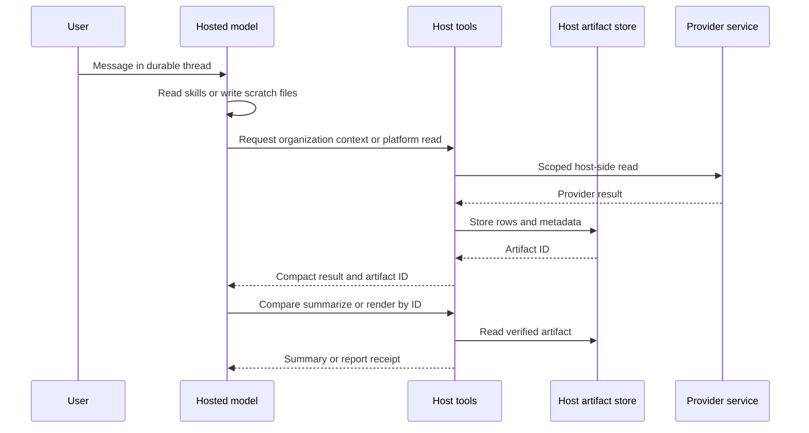

## Boundary at a glance

Managed Deep Agents (MDA) owns the managed envelope around the assembled agent: its durable-thread sandbox, checkpointing, identity, schedules, and Slack integration. The repository supplies the model, tools, middleware, and approval interrupts through the deliberately thin `agent.py` entry point. [^mda-runtime] [^mda-entry]

**The hosted model does not receive a repository checkout.** Its readable filesystem is the per-thread MDA sandbox: `/skills`, which MDA syncs (including the business wiki), and `/workspace`, the thread scratch space. Organization context, provider access, and host-written artifacts are not implicitly mounted into that filesystem. The model reaches those resources through its host tools; artifacts remain on deployment disk and are referred to by opaque IDs. [^hosted-filesystem]

This differs intentionally from the local runtime. Local compilation uses a `FilesystemBackend` rooted at the project directory, subject to explicit deny rules for `.env`, virtual-environment, Git, and MDA paths; writes are only allowed under `/workspace`. Do not use that local implementation detail to infer that a hosted deployment exposes the checkout. [^local-filesystem]



*The model works in its per-thread filesystem while host tools retain access to organization data, providers, and durable artifacts.*

## What crosses the boundary

### Skills and scratch space

The sandbox image creates `/skills` and `/workspace` with `in`, `out`, and `analysis` directories, but it contains no application checkout, skills, wiki, workspace content, or secrets. The optional image bakes only Python, command-line utilities, and PDF-rendering dependencies. MDA supplies skills to the production sandbox; the separate probe emulates that mount by uploading the repository `skills/` tree and creating the workspace layout. [^dockerfile] [^sandbox-mount]

A generated `sandbox/__init__.py` is the MDA-facing declaration, not an ordinary application configuration file: MDA reads its `define_sandbox(...)` call statically. `paid-media-agent sandbox use <snapshot>` writes both that literal declaration and `PAID_MEDIA_SANDBOX_SNAPSHOT` for the CLI probe. A UUID is declared as `snapshot_id`; a non-UUID is treated as a snapshot name, but Dockerfile-built snapshots are stored and resolved by immutable ID. `paid-media-agent mda check` warns/blocks when an environment snapshot exists without the declaration MDA reads. [^declaration] [^snapshot-reference] [^mda-check]

With no snapshot declaration, the configured setting is empty and MDA uses its platform image. The optional snapshot is therefore a capability addition—principally the pinned WeasyPrint stack and its native libraries—not a way to deploy repository or secret material. [^settings-snapshot] [^dockerfile]

### Organization data and provider access

Organization context is host-resident. `get_org_context` returns rendered goals, conventions, and source names, or one named shared source; it caps returned source text at 12,000 characters and rejects unknown source names. `update_org_profile` and `add_org_source` are host tools as well. The latter stores only a public HTTPS source through the host implementation, rather than granting sandbox network access. [^org-tools] [^org-source-tool]

Platform reads are likewise dispatched on the host. The dispatcher rechecks the current authorized catalog and tool schema, accepts only a configured account alias, rejects raw provider IDs, injects the host-owned provider ID, validates the provider schema, and applies a timeout to the provider call. Thus a sandbox process does not need credentials or direct provider egress to analyse campaign data. [^read-dispatch] [^read-execute]

## Artifacts: IDs rather than a shared filesystem

`ArtifactStore` owns JSON records under a host workspace and returns metadata containing a generated `art_` ID, digest, size, schema version, and provenance. On read it validates the ID and path containment, then recalculates the payload SHA-256; a tampered artifact fails rather than being used in analysis. [^artifact-store] [^artifact-tests]

A platform read normalizes rows and writes them as a `performance_rows` artifact, returning only a compact result with its artifact ID, coverage/quality metadata, and a small preview. `compare_periods` and `summarize_window` reload those IDs host-side for deterministic arithmetic; comparison rejects unequal windows, non-row artifacts, missing coverage, and empty windows rather than treating unavailable data as zero. [^read-offload] [^compare-artifacts]

`render_report` similarly takes an analysis artifact ID, reconciles the generated payload against the analysis before rendering, then validates each deliverable through `ArtifactBridge`. The bridge rejects paths outside the output root and symlinks, accepts only HTML/PDF/JSON suffixes, and enforces a nonzero 15 MiB maximum. This is the delivery boundary for host files, not a general model-controlled file export. [^report-render] [^artifact-bridge]

## Snapshot publication and verification

Use a snapshot only when the platform image lacks dependencies the sandbox must have:

```bash
uv run paid-media-agent sandbox publish --name paid-media-agent-sandbox
uv run paid-media-agent sandbox test --json
```

`publish` sends a temporary build context containing **only** `sandbox/Dockerfile` to LangSmith, waits for a `ready` snapshot, then records its ID using `sandbox use`; no local Docker build and no `.env`, skills, or wiki are included in that build context. Build failures and non-ready results are returned as failed actions. [^snapshot-publish]

`sandbox test` opens a disposable sandbox from the declared snapshot, gives it five-minute idle and delete-after-stop TTLs, constrains its proxy allow-list to localhost addresses, runs the probe, and deletes it in `finally`. The probe checks Python, uploads and lists skills/wiki, verifies workspace layout, renders a small PDF inside the sandbox and checks its PDF header after download, and fails if key-like environment variable names are visible. Provider and platform operations are host-side, so the probe sandbox needs no outbound network. [^sandbox-open] [^sandbox-probe] [^sandbox-test-lifecycle]

`paid-media-agent doctor --snapshot` is a complementary local/in-image compatibility diagnostic: it checks Python version, selected imports and binaries, known secret-environment presence, workspace write access, outside SSH-path visibility, and PDF renderer availability. It deliberately reports outbound-network policy only as a warning because that policy cannot be proven from inside the process. Treat a successful snapshot ID or build as insufficient evidence; run the probe against the actual declared snapshot before deploying a PDF-dependent workflow. [^snapshot-doctor]

### PDF scope and operational caution

The Dockerfile pins WeasyPrint and installs its Pango/Cairo-related native dependencies, and the probe proves that this exact sandbox can render a PDF. However, the standard agent assembly constructs `render_report` without passing the probe-only `SandboxPdfEngine`; the report tool otherwise uses its configured/default host renderer. Therefore, a passing sandbox PDF probe proves snapshot capability and isolation, **not by itself** that every hosted report request is rendered inside that sandbox. Verify the production report-renderer wiring and delivery path when changing PDF deployment behavior. [^dockerfile] [^pdf-engine] [^assembly-report]

## Focused safety checks

- Run `uv run paid-media-agent mda check --json` after selecting or changing a snapshot; it verifies the MDA prerequisites and catches a declared environment snapshot that lacks the static declaration. [^mda-check]
- Run `uv run paid-media-agent sandbox test --json` with a LangSmith key that can create sandboxes. The integration test is opt-in (`PAID_MEDIA_LIVE_TESTS=1` plus a snapshot) and asserts that every probe check is `ok`. [^sandbox-test-lifecycle] [^live-sandbox-test]
- Keep snapshot contents minimal. The unit probe test confirms skills are uploaded under `/skills`, PDF bytes return to the host, missing WeasyPrint becomes a failed probe check, and immutable IDs are preferred. Artifact tests separately cover path traversal, digest mismatch, outside output paths, and disallowed delivery types. [^sandbox-unit-test] [^artifact-tests] [^bridge-tests]

[^mda-runtime]: `src/paid_media_agent/runtime/mda.py#L1-L5`
[^mda-entry]: `agent.py#L1-L21`
[^hosted-filesystem]: `OPERATIONS.md#L77-L84`
[^local-filesystem]: `src/paid_media_agent/runtime/local.py#L1-L5`, `src/paid_media_agent/runtime/local.py#L28-L38`, `src/paid_media_agent/runtime/local.py#L51-L70`
[^dockerfile]: `sandbox/Dockerfile#L1-L14`
[^sandbox-mount]: `src/paid_media_agent/runtime/sandbox.py#L23-L33`, `src/paid_media_agent/runtime/sandbox.py#L79-L92`
[^declaration]: `src/paid_media_agent/admin/actions.py#L877-L918`
[^snapshot-reference]: `src/paid_media_agent/runtime/sandbox.py#L36-L45`
[^mda-check]: `src/paid_media_agent/admin/actions.py#L672-L719`
[^settings-snapshot]: `src/paid_media_agent/config.py#L100-L117`
[^org-tools]: `src/paid_media_agent/tools/org.py#L1-L6`, `src/paid_media_agent/tools/org.py#L68-L149`
[^org-source-tool]: `src/paid_media_agent/org.py#L231-L258`, `src/paid_media_agent/tools/org.py#L107-L116`
[^read-dispatch]: `src/paid_media_agent/tools/reads.py#L119-L185`
[^read-execute]: `src/paid_media_agent/tools/reads.py#L187-L214`
[^artifact-store]: `src/paid_media_agent/tools/artifacts.py#L61-L79`, `src/paid_media_agent/tools/artifacts.py#L81-L145`
[^artifact-tests]: `tests/unit/test_proposals_and_security.py#L110-L124`
[^read-offload]: `src/paid_media_agent/tools/reads.py#L234-L324`
[^compare-artifacts]: `src/paid_media_agent/tools/compare_periods.py#L43-L124`, `src/paid_media_agent/tools/summary.py#L147-L170`
[^report-render]: `src/paid_media_agent/tools/reports.py#L36-L76`
[^artifact-bridge]: `src/paid_media_agent/reports/bridge.py#L10-L60`
[^snapshot-publish]: `src/paid_media_agent/admin/actions.py#L922-L970`
[^sandbox-open]: `src/paid_media_agent/runtime/sandbox.py#L123-L146`
[^sandbox-probe]: `src/paid_media_agent/runtime/sandbox.py#L155-L190`
[^sandbox-test-lifecycle]: `src/paid_media_agent/admin/actions.py#L973-L1004`
[^snapshot-doctor]: `src/paid_media_agent/doctor.py#L246-L311`
[^pdf-engine]: `src/paid_media_agent/runtime/sandbox.py#L98-L120`
[^assembly-report]: `src/paid_media_agent/assembly.py#L202-L214`
[^live-sandbox-test]: `tests/integration/test_live_sandbox.py#L1-L26`
[^sandbox-unit-test]: `tests/unit/test_sandbox_backend.py#L61-L108`
[^bridge-tests]: `tests/unit/test_reads_and_surfaces.py#L189-L202`
