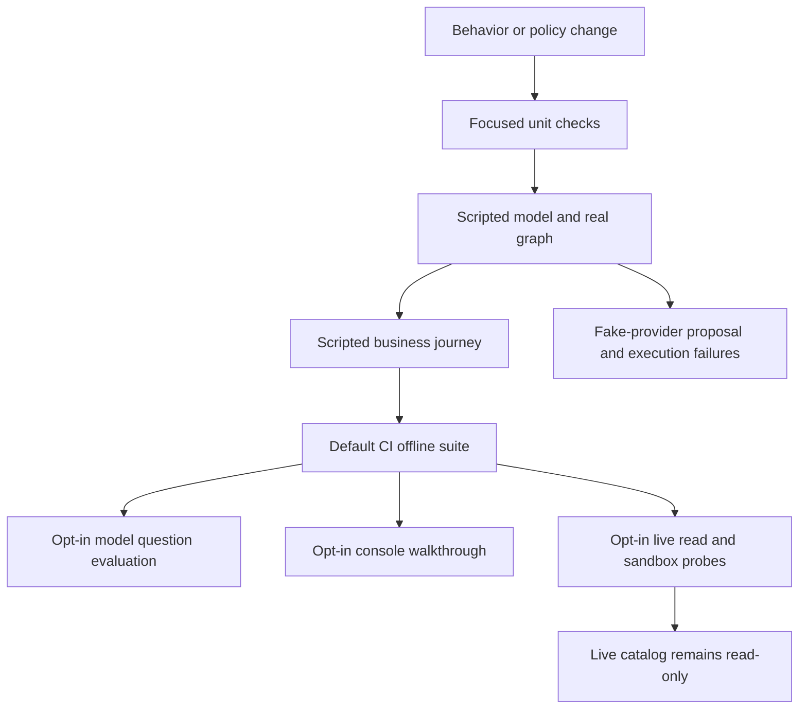

# Verification Strategy and Safety Contracts

Verification is layered around the system's safety boundaries, not around a one-to-one file inventory. The default suite is offline: shared fixtures use a scripted model, fixture catalog, temporary workspace, and fake write provider, while the autouse fixture pins the fixture date and restores the process environment after each test. [tests/conftest.py](repo://tests/conftest.py#L18-L43) This makes catalog, graph, approval, report, console, and runtime-parity regression checks repeatable without provider credentials or a model call.

The critical test contract is stronger than “writes are normally off”: automated tests must never perform a live provider mutation. The live-like contract provider only records calls, and the tests demonstrate that disabled writes, an unreleased live catalog, a stale reviewed revision, or an unreleased canary tool all reject before that provider is called. [tests/contract/test_live_write_gates.py](repo://tests/contract/test_live_write_gates.py#L38-L64) [tests/contract/test_live_write_gates.py](repo://tests/contract/test_live_write_gates.py#L75-L152) This mirrors the production gate ordering: a real provider requires no kill switch, `PAID_MEDIA_WRITES_ENABLED=true`, a reviewed revision equal to the current catalog, and release of the exact canary tool. [src/paid_media_agent/tools/writes.py](repo://src/paid_media_agent/tools/writes.py#L169-L226)



This flow shows the intended escalation: start with the smallest deterministic test that proves the changed boundary, then use opt-in environment checks only for the external integration they uniquely cover.

## Default test entrypoint and release invariant

Run the repository suite with:

```bash
uv run --frozen pytest -q
```

`pytest` collects under `tests`, runs asynchronous tests automatically, and the project requires Python 3.11 or later. [pyproject.toml](repo://pyproject.toml#L8-L9) [pyproject.toml](repo://pyproject.toml#L65-L83) CI executes this command on Python 3.11 and 3.13 after a frozen all-extras development install. The same job also enforces Ruff lint and formatting, strict mypy on `src`, runs the fixture demo with a proposal, imports the MDA definition, and scans tracked source/document/config formats for credential-shaped secrets. [.github/workflows/ci.yml](repo://.github/workflows/ci.yml#L11-L40)

A change is not release-ready merely because a narrow test passes. Preserve the offline suite, static analysis, fixture-demo smoke, agent-definition import, and secret scan. For a change at a safety boundary, add or update the focused failure-path assertion alongside the successful path—for example, prove both a valid alias dispatch and raw-ID rejection, or both a signed approval and rejection before provider invocation.

## Coverage map: choose the smallest proving layer

| Changed area | First focused test | Contract or behavior proof to preserve | Escalate when |
| --- | --- | --- | --- |
| Catalog admission, revision, schema, provider metadata | `tests/unit/test_catalog_policy.py` | Unknown platform/schema/metadata and destructive or unadmitted mutations fail closed; a schema change changes catalog identity. | The assembled graph or a provider loader changes. |
| Model-visible reads and read artifacts | `tests/unit/test_reads_and_surfaces.py` | Aliases replace raw IDs; scope and JSON Schema checks run before dispatch; malformed or stale selections fail safely. | Tool binding, discovery, or selection changes. |
| Selection and model surface | `tests/contract/test_selection_matrix.py`, `tests/contract/test_read_path_graph.py` | Native and portable selection start from the same authorized catalog; hidden, hallucinated, mutation, and stale calls cannot widen the surface. | Provider-specific selection capability changes. |
| Deterministic analysis, reports, Slack presentation | `tests/unit/test_reads_and_surfaces.py` | Missing coverage suppresses totals, model text is escaped, and bridged output stays in the allowed directory/type set. | A real-graph answer or scheduled reporting behavior changes. |
| Proposal, approval, write gate, receipt | `tests/unit/test_write_policy_and_gate.py`, `tests/contract/test_write_flows_graph.py` | Validation precedes one mutation attempt; all authorization, freshness, replay, and readback failure states keep unsafe execution from occurring. | Any graph interrupt, transport, persistence, or gate integration changes. |
| Console setup/API | `tests/contract/test_console_api.py` | Local host/token checks, CSP/static assets, secret masking, config allow-list, kill switch, and deploy confirmation hold. | Rendered DOM, forms, or browser-only errors change. |
| Shared local/MDA and Slack parity | `tests/contract/test_surfaces_and_runtimes.py` | MDA and local compilation use the governed shared surface; Slack review resumes the same graph and deduplicates events. | Runtime/profile, sandbox, or transport wiring changes. |
| Sandbox image/mount integration | `tests/integration/test_live_sandbox.py` | A configured published snapshot can mount skills/workspace, render PDF, and expose no key-like environment values. | Snapshot or sandbox configuration changes. |

The table is intentionally a decision aid, not a requirement to run every layer for every edit. A documentation-only change does not need a sandbox probe; a new write-policy field needs the policy unit test plus the graph’s rejection path, not a live mutation.

## What the offline layers establish

### Unit contracts: policy and pure boundary behavior

Catalog tests are the first line for admission changes. They verify deny-by-default classification for absent/malformed metadata, unsafe names, unknown platform, malformed schema, and absent account scope; mutations require explicit admission and destructive hints remain denied. They also verify stable catalog identity and that schema changes alter both schema hash and catalog revision. [tests/unit/test_catalog_policy.py](repo://tests/unit/test_catalog_policy.py#L30-L117) This corresponds to the catalog’s local, repository-owned policy and revision computation. [src/paid_media_agent/tools/catalog.py](repo://src/paid_media_agent/tools/catalog.py#L70-L111) [src/paid_media_agent/tools/catalog.py](repo://src/paid_media_agent/tools/catalog.py#L257-L299)

Read/surface unit tests exercise the host boundary without a model: the model-facing schema removes the provider account argument; dispatch rejects raw IDs, wrong-platform aliases, invalid or extra arguments, unknown/non-read tools, and stale selection hashes. [tests/unit/test_reads_and_surfaces.py](repo://tests/unit/test_reads_and_surfaces.py#L40-L86) The dispatcher resolves the current catalog before injecting the host-owned provider ID and validating the original provider schema, then keeps only bounded, alias-based audit details. [src/paid_media_agent/tools/reads.py](repo://src/paid_media_agent/tools/reads.py#L142-L214)

Use `test_write_policy_and_gate.py` for a changed policy row, risk flag, release setting, or provider error mapping. It validates catalog/policy compatibility, rejects bad policy rows and unknown keys, derives reviewer-facing risk facts, and enumerates the fake/live gate matrix. [tests/unit/test_write_policy_and_gate.py](repo://tests/unit/test_write_policy_and_gate.py#L21-L134) The gate test should remain a no-network test: fake providers may pass only when the kill switch is absent; it does not authorize real providers.

For reports and presentation, the same unit module proves that unavailable sources suppress a cross-platform total, missing metrics remain unavailable rather than zero, report reconciliation detects omissions/tampering, model text is HTML-escaped, artifact bridging rejects paths/types outside the output allow-list, and Slack action values carry opaque routing rather than change payload. [tests/unit/test_reads_and_surfaces.py](repo://tests/unit/test_reads_and_surfaces.py#L89-L230)

### Graph contracts: the shared runtime in motion

Contract tests use the real compiled local graph with `ScriptedChatModel` steps and in-memory checkpointing. The helper injects catalog/profile/provider/checkpointer dependencies, while proposal helpers drive the actual `propose_change` and `execute_change` tool sequence. [tests/contract/helpers.py](repo://tests/contract/helpers.py#L28-L94) Local compilation passes the shared components—including tools, middleware, interrupt map, filesystem permissions, and checkpointer—to `create_deep_agent`; it defaults to a fixture catalog/profile and `InMemorySaver`. [src/paid_media_agent/runtime/local.py](repo://src/paid_media_agent/runtime/local.py#L51-L107)

Read-path graph tests prove model-surface invariants that a dispatcher-only test cannot: the fixture demo produces reconciled, artifact-citing output without raw provider IDs in the transcript; hidden built-ins, direct mutation names, and hallucinated names return denied tool messages; and a catalog changed after tool binding fails as `stale_selection`. [tests/contract/test_read_path_graph.py](repo://tests/contract/test_read_path_graph.py#L15-L110) Keep these checks when modifying tool assembly, invocation guard, or artifact-facing result shape.

Selection-matrix tests provide runtime parity across provider capability paths. Native Anthropic/OpenAI selection defers every authorized platform read and injects one provider search tool; the portable path binds only the selected reads plus core tools. An invalid portable selection falls back to core tools, and the two strategies expose the same authorized tool names and catalog revision. [tests/contract/test_selection_matrix.py](repo://tests/contract/test_selection_matrix.py#L59-L190) The implementation constructs both paths from the authorized platform-read names and treats invalid selection as a core-only fallback. [src/paid_media_agent/middleware/tool_selection.py](repo://src/paid_media_agent/middleware/tool_selection.py#L149-L177) [src/paid_media_agent/middleware/tool_selection.py](repo://src/paid_media_agent/middleware/tool_selection.py#L180-L218)

### Governed write contracts: test failure before success

The write-flow graph tests are the authoritative regression set for stateful execution. The happy path pauses at `execute_change` for human review, leaves the fake provider untouched before approval, then performs one fake mutation and reaches a verified receipt after readback. [tests/contract/test_write_flows_graph.py](repo://tests/contract/test_write_flows_graph.py#L45-L72) The executor verifies claim signature/scope/digest/expiry, current catalog/policy/account compatibility, and the gate before marking a claim used and making the provider call. [src/paid_media_agent/tools/writes.py](repo://src/paid_media_agent/tools/writes.py#L612-L661) [src/paid_media_agent/tools/writes.py](repo://src/paid_media_agent/tools/writes.py#L753-L824)

When changing this path, pair the positive case with the closest relevant rejection:

- **Identity and approval:** non-approvers and self-approvers are rejected; tampering, revision edits, expiry, and claim replay do not make another mutation. [tests/contract/test_write_flows_graph.py](repo://tests/contract/test_write_flows_graph.py#L95-L205)
- **Scope and freshness:** foreign account/target, non-editable fields, unadmitted mutations, and stale catalog/policy state fail with no fake-provider mutation. [tests/contract/test_write_flows_graph.py](repo://tests/contract/test_write_flows_graph.py#L208-L258) [tests/contract/test_live_write_gates.py](repo://tests/contract/test_live_write_gates.py#L170-L195)
- **Execution truthfulness:** validation-only happens before the single mutation; validation refusal makes no attempt. Provider timeout is never retried: readback determines `verified` if after-state matches, `failed` if before-state remains, or `unknown` when bounded readback cannot prove state. [tests/contract/test_live_write_gates.py](repo://tests/contract/test_live_write_gates.py#L257-L303) [tests/contract/test_write_flows_graph.py](repo://tests/contract/test_write_flows_graph.py#L281-L307) The executor’s bounded readback and receipt mapping implement these outcomes. [src/paid_media_agent/tools/writes.py](repo://src/paid_media_agent/tools/writes.py#L692-L739) [src/paid_media_agent/tools/writes.py](repo://src/paid_media_agent/tools/writes.py#L846-L892)
- **Recovery and rejection:** the same persisted services and checkpoint allow a rebuilt graph to resume an awaiting review, while an explicit rejection leaves the provider untouched. [tests/contract/test_write_flows_graph.py](repo://tests/contract/test_write_flows_graph.py#L310-L375)

The separate live-write-gate suite must remain deliberately non-live. It tests a non-fake recording provider precisely to establish that no test gate combination reaches its mutation method, and separately confirms that a kill switch stops even fake execution. [tests/contract/test_live_write_gates.py](repo://tests/contract/test_live_write_gates.py#L75-L93) [tests/contract/test_live_write_gates.py](repo://tests/contract/test_live_write_gates.py#L155-L167)

### Scripted behavior: user-facing journeys without nondeterminism

Behavior checks use the scripted model through the real graph rather than asserting an LLM’s wording. The demo journey must discover tools before platform reads, perform period comparison after a read, cite analysis/source artifacts, and preserve causal caveats. A deliberately mismatched comparison window must report the issue rather than guess. [tests/behavior/test_scripted_behavior.py](repo://tests/behavior/test_scripted_behavior.py#L16-L67) Add a behavior test when a change affects an observable multi-tool journey or a “do not invent/guess” promise; keep numeric and authorization assertions in unit or contract tests where failures are diagnosable.

## Surface and runtime checks

The console contract suite is a FastAPI `TestClient` check against a copied temporary project. It verifies CSP/static serving and traversal rejection, token plus localhost restrictions, masked secret configuration and allow-listed updates, account/policy actions, one-way kill-switch disengagement confirmation, fixture demo execution, and deploy-process confirmation. [tests/contract/test_console_api.py](repo://tests/contract/test_console_api.py#L16-L32) [tests/contract/test_console_api.py](repo://tests/contract/test_console_api.py#L35-L149) Use it for API/server behavior; it does not replace browser rendering coverage.

Shared-surface contracts establish parity where a regression could otherwise fork behavior: Slack button approval identifies the requesting/reviewing principals, drops duplicate events, resumes the same graph, and produces a verified fake-provider receipt; the MDA definition exposes shared governed tools and middleware while excluding direct mutations; the configured local runtime uses the deployment profile but falls back to fake fixtures without live credentials. [tests/contract/test_surfaces_and_runtimes.py](repo://tests/contract/test_surfaces_and_runtimes.py#L35-L107) [tests/contract/test_surfaces_and_runtimes.py](repo://tests/contract/test_surfaces_and_runtimes.py#L110-L156)

## Opt-in checks: external confidence without changing the offline default

### Model question evaluation

Question evaluation is not part of `pytest`, because it runs a live agent server with a model against synthetic fixtures. Start a server, collect results in fresh threads, then grade them:

```bash
uv run langgraph dev --no-browser --port 2025
uv run python tests/eval/run_questions.py http://127.0.0.1:2025 results.jsonl
uv run python tests/eval/grade.py results.jsonl
```

The runner records tool calls, answer text, timing, and bounded errors for each question. [tests/eval/run_questions.py](repo://tests/eval/run_questions.py#L27-L56) The grader computes deterministic fixture spend/conversions/CPA for selected questions, fails missing numeric expectations or run errors, and prints the remaining tools/timing/expectation for human review. Its date offset follows `PAID_MEDIA_FIXTURE_ANCHOR`, matching the synthetic-data server. [tests/eval/grade.py](repo://tests/eval/grade.py#L18-L25) [tests/eval/grade.py](repo://tests/eval/grade.py#L37-L107) Use this after modifying prompts, model selection, tool-use behavior, or answer presentation—not as a substitute for a focused deterministic regression.

### Browser walkthrough

The Playwright walkthrough is also outside `pytest`: it needs Node 22, Playwright/Chromium, and a throwaway project copy so setup form submissions cannot alter a real `.env`. [tests/e2e/README.md](repo://tests/e2e/README.md#L1-L23) It walks the setup screens, provider/custom-key form, account step, in-page ask, Studio start/stop, managed choice, theme toggle, and completion while taking screenshots and failing on browser console/page errors. [tests/e2e/console_walkthrough.mjs](repo://tests/e2e/console_walkthrough.mjs#L1-L17) [tests/e2e/console_walkthrough.mjs](repo://tests/e2e/console_walkthrough.mjs#L45-L77) Run it for changed console markup, JavaScript, styles, or process controls, always against the documented throwaway copy.

### Live integration: read-only catalog and sandbox probe

Live checks are explicitly skipped unless an operator opts in. `PAID_MEDIA_LIVE_TESTS=1` enables the Pipeboard check only when `PIPEBOARD_API_TOKEN` is configured; it refreshes the catalog and asserts every admitted entry is an account-scoped read and that no mutations are admitted before live-write release review. [tests/integration/test_live_readonly.py](repo://tests/integration/test_live_readonly.py#L11-L30) This is a live **read-only** check, never a provider mutation.

The sandbox check additionally requires `PAID_MEDIA_SANDBOX_SNAPSHOT`. It opens a short-lived sandbox, runs the probe, closes it in `finally`, and requires every probe check to pass. [tests/integration/test_live_sandbox.py](repo://tests/integration/test_live_sandbox.py#L13-L27) The probe validates runtime/Python, mounts skills and workspace layout, checks the mounted wiki, renders a PDF, and fails if key-like environment values are visible; sandbox egress is limited to localhost. [src/paid_media_agent/runtime/sandbox.py](repo://src/paid_media_agent/runtime/sandbox.py#L23-L33) [src/paid_media_agent/runtime/sandbox.py](repo://src/paid_media_agent/runtime/sandbox.py#L155-L190)

## Focused regression checklist

1. Identify the changed boundary and run its smallest relevant test file first.
2. Add a success assertion only if its paired critical refusal/error assertion already exists or is added in the same change.
3. For catalog/selection changes, verify both model binding and invocation-time re-resolution; selection is context optimization, not authorization.
4. For write changes, use `FakeWriteProvider` or a recording non-fake provider that is asserted untouched. Do not recommend or add an automated live provider mutation.
5. For a timeout or uncertain provider outcome, assert receipt semantics and no retry, not a presumed final state.
6. Run the offline suite before release; then run evaluation, browser, live read-only, or sandbox checks only when the edited integration warrants them and the operator has explicitly configured the environment.

For implementation detail, see [Shared Agent Assembly and Runtime Boundaries](/openwiki/architecture/shared-agent-runtime.md), [Authorized Tool Catalog, Reads, and Analysis Artifacts](/openwiki/concepts/authorized-catalog-and-read-data.md), and [Governed Write Protocol](/openwiki/concepts/governed-write-protocol.md).
