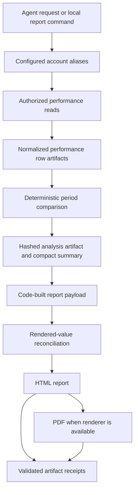

# Analysis and Deterministic Reporting Workflow

This workflow separates language from calculation. An interactive agent may choose authorized reads and provide a bounded executive summary and recommendations, but normalized rows, window comparison, arithmetic, quality checks, report structure, reconciliation, and file delivery are owned by deterministic host code. The local `report` command goes further: it performs the complete cadence pipeline with no model. For reporting judgment and vocabulary rather than implementation behavior, use [the paid-media reporting guidance](../../skills/paid-media-wiki/reporting.md).

## Entrypoints and responsibilities

| Entry point | What runs | Window and rendering behavior |
|---|---|---|
| Agent request | The model calls `list_accounts`, authorized platform reads, `compare_periods`, then `render_report`. | The model supplies only bounded narrative fields to rendering; it must use analysis artifacts for figures. |
| `uv run paid-media-agent report --cadence weekly\|monthly` | `run_cadence_report` using the configured deployment-equivalent profile. | Reads selected aliases or all aliases, compares deterministic trailing windows, and renders unless `--no-render` is given. The default end is yesterday. |
| Managed schedules | Managed Deep Agents starts the agent with a report-specific prompt. | Weekly is 13:00 UTC each Monday; monthly is 13:00 UTC on day 1. The prompts request reads, comparison, and rendering, rather than invoking the local code-only CLI pipeline. |

The local command accepts a repeatable `--alias`, `--end` as the last complete day, `--no-render`, and JSON output. It returns nonzero if the cadence pipeline cannot produce any usable performance rows or if its final result is unreconciled. [cli.py](repo://src/paid_media_agent/cli.py#L475-L560) Its configured runtime construction is shared with the deployment profile; operational setup and environment/sandbox concerns belong in [Local Setup and Managed Deployment](/openwiki/operations/local-setup-and-managed-deployment.md) and [Sandbox and Hosted Context](/openwiki/operations/sandbox-and-hosted-context.md).

This diagram shows the common artifact-centered path; the scheduled MDA prompts use the agent-tool variant, while the CLI invokes the deterministic cadence orchestrator directly.

## From account alias to trustworthy input

Accounts are host-owned mappings from a public alias to platform, provider account ID, currency, and timezone. The model sees aliases rather than provider IDs. Before a read, `ReadDispatcher` resolves the *current* authorized catalog entry, ensures it is still a read and has not become stale since selection, validates the alias/platform relationship, rejects raw provider IDs, injects the host-held ID, and applies the provider schema. [config.py](repo://src/paid_media_agent/config.py#L52-L97) [reads.py](repo://src/paid_media_agent/tools/reads.py#L142-L185) See [Authorized Tool Catalog, Reads, and Analysis Artifacts](/openwiki/concepts/authorized-catalog-and-read-data.md) for catalog admission, discovery, and provider integration details.

The dispatcher time-bounds the provider call. For a nonempty `rows` response it normalizes rows and stores a `performance_rows` artifact with requested/actual window, completeness and missing-field flags, source metadata, and provider totals. A non-row response is retained as `provider_result`, which cannot be period-compared. [reads.py](repo://src/paid_media_agent/tools/reads.py#L187-L214) [reads.py](repo://src/paid_media_agent/tools/reads.py#L234-L324)

`ArtifactStore` makes the period comparison reproducible from a workspace artifact rather than a preview in a chat transcript. It writes canonical JSON payload bytes with an opaque ID and SHA-256, records schema/source/window metadata, and recomputes the hash on read; invalid IDs, paths escaping the workspace, altered content, and missing artifacts fail. [artifacts.py](repo://src/paid_media_agent/tools/artifacts.py#L61-L150)

## Compare periods: deterministic invariants

`compare_periods` takes one or more `performance_rows` artifact IDs and equal-length current and previous date ranges. It rejects reversed ranges, an empty artifact list, a wrong artifact kind, a read that begins after either requested window, and a window with no rows. In particular, an empty historical window is an error—not zero performance. It then serializes a versioned `PeriodComparison` as an `analysis` artifact and returns a compact summary containing its ID. [compare_periods.py](repo://src/paid_media_agent/tools/compare_periods.py#L43-L124) The summary is a presentation of code-derived values and directs callers not to recompute them. [compute.py](repo://src/paid_media_agent/tools/compute.py#L375-L423)

At platform scope, compute requires a single currency and timezone and the requested entity grain. It aggregates raw measures before calculating ratios, preserves metrics missing from every row as unavailable, treats zero/missing denominators as unavailable ratios, quantizes Decimal calculations, and produces absolute and relative deltas only when the inputs permit them. It flags duplicate rows, incomplete windows, missing metrics, and entities that occur in just one window. [compute.py](repo://src/paid_media_agent/tools/compute.py#L33-L114) [compute.py](repo://src/paid_media_agent/tools/compute.py#L135-L214)

Reconciliation is also computation, not a narrative assertion: each platform checks whether current entity spend sums to platform spend and, when provider totals are available, whether all rows reconcile to provider spend and row count. `PeriodComparison.reconciled` is true only when every recorded check passes. [compute.py](repo://src/paid_media_agent/tools/compute.py#L216-L275) [analysis.py](repo://src/paid_media_agent/domain/analysis.py#L107-L125)

A cross-platform total exists only if there are platforms and none of the following applies: a requested source is unavailable, currencies differ, either platform window is incomplete, a platform lacks a metric field, or platform date bounds differ. Otherwise the comparison keeps per-platform results and a suppression reason. This avoids manufacturing a portfolio total from incompatible coverage; platform-reported conversion attribution is displayed as per-platform data, not deduplicated people. [compute.py](repo://src/paid_media_agent/tools/compute.py#L301-L341) [render.py](repo://src/paid_media_agent/reports/render.py#L150-L174) Attribution interpretation belongs in [the paid-media metrics and attribution guidance](../../skills/paid-media-wiki/metrics-and-attribution.md).

For a single-window investigation, `summarize_window` is a different deterministic tool: it returns aggregate/per-entity totals, daily points and day-over-day flags, plus optional budget pacing sourced from `list_campaigns` artifacts; it does not replace `compare_periods` for period-over-period reporting. [summary.py](repo://src/paid_media_agent/tools/summary.py#L1-L6) [summary.py](repo://src/paid_media_agent/tools/summary.py#L68-L170)

## Cadence execution and unavailable sources

`report_windows` builds complete equal-length windows ending on the caller's supplied end date: 7 days per weekly run and 28 days per monthly run, with the preceding equal-length window for comparison. `run_cadence_report` defaults to every configured alias, performs each campaign-performance read over the union of both windows, and records unknown aliases, missing performance tools, read denial/errors, and non-performance responses as unavailable while continuing healthy sources. If no source yields performance rows, it raises and stops. [cadence.py](repo://src/paid_media_agent/reports/cadence.py#L29-L49) [cadence.py](repo://src/paid_media_agent/reports/cadence.py#L64-L128)

Unavailable entries are passed to comparison, so they remain visible and suppress a cross-platform total; they do not suppress useful per-platform sections. The code-generated fallback summary describes per-platform spend direction and records total suppression and unavailable sources; a caller may instead pass an executive summary. [cadence.py](repo://src/paid_media_agent/reports/cadence.py#L129-L171)

The managed schedules encode a related agent workflow: weekly requests the last 14 complete days and compares two seven-day periods, and monthly requests 56 complete days and compares two 28-day periods. Both run at their declared UTC cron times and explicitly require unavailable platforms to remain visible. [weekly_report.py](repo://schedules/weekly_report.py#L1-L15) [monthly_report.py](repo://schedules/monthly_report.py#L1-L14)

## Render, verify, and deliver

`render_report` reads only an `analysis` artifact, validates it as `PeriodComparison`, builds the versioned payload from its platform values, and reconciles that payload before writing files. A mismatch—including altered raw/formatted values, omitted platform sections, scorecard state inconsistent with total suppression, or omitted unavailable sources—raises an `ArtifactError` and prevents rendering. [reports.py](repo://src/paid_media_agent/tools/reports.py#L36-L76) [render.py](repo://src/paid_media_agent/reports/render.py#L204-L235)

The payload builder owns scorecard rows, definitions, formatting, source coverage, per-platform sections, top spend-mover ordering, data-quality statements, and provenance linking the analysis and source artifacts. The HTML template renders scope, narrative, a reconciled scorecard or suppression notice, platform tables, unavailable sources, recommendations, quality notes, and provenance. Jinja autoescaping and `StrictUndefined` protect rendering from silently missing fields and unescaped narrative content. [render.py](repo://src/paid_media_agent/reports/render.py#L108-L201) [render.py](repo://src/paid_media_agent/reports/render.py#L297-L320) [report.html.j2](repo://src/paid_media_agent/reports/templates/report.html.j2#L21-L90)

HTML is always written first. PDF is attempted only when the configured `PdfEngine` reports availability; unavailable WeasyPrint native libraries result in an HTML receipt plus a PDF-unavailable detail, rather than failing the HTML report. Every candidate file then passes through `ArtifactBridge`, which requires an in-root non-symlink regular file, allows only `.html`, `.pdf`, or `.json`, and rejects zero-byte or over-15 MiB artifacts. Receipts contain a relative path, media type, byte size, and validation time. [render.py](repo://src/paid_media_agent/reports/render.py#L245-L320) [bridge.py](repo://src/paid_media_agent/reports/bridge.py#L10-L60)

## Change and test guide

When extending this workflow, keep these ownership boundaries intact: add provider fields through normalization and artifacts; add arithmetic, quality flags, reconciliation, or layout in deterministic code; and keep model input limited to narrative and structured recommendations. Adding a platform must preserve the authorized account-scoped read path described above. Do not make a template or model “fix” missing source coverage.

Focused offline coverage verifies the key contracts: fixture cadence windows and runs cover complete equal windows, rendering, reconciliation, and unknown aliases; compute tests prove missing/zero behavior, reconciliation, incomplete windows, and total suppression; report tests exercise missing-source output, reconciliation tampering, escaping, and bridge path/type denial. [test_report_cadence.py](repo://tests/unit/test_report_cadence.py#L12-L60) [test_compute.py](repo://tests/unit/test_compute.py#L53-L173) [test_reads_and_surfaces.py](repo://tests/unit/test_reads_and_surfaces.py#L89-L202)
