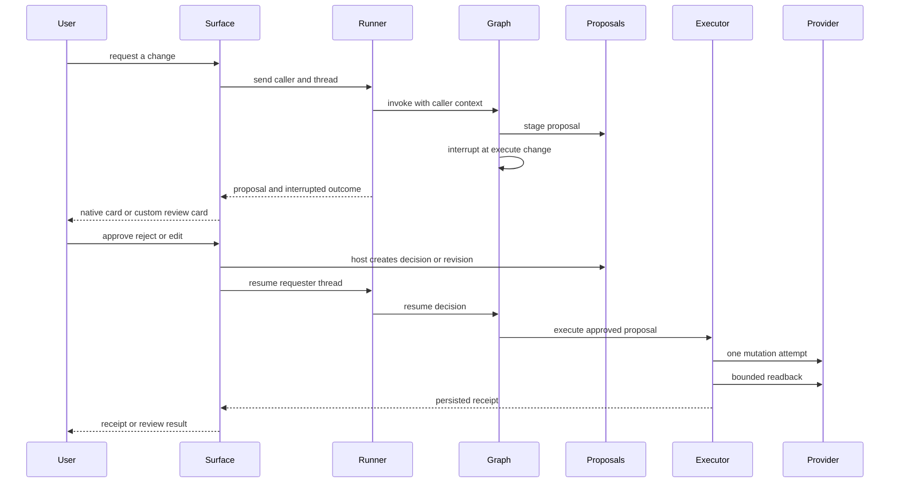
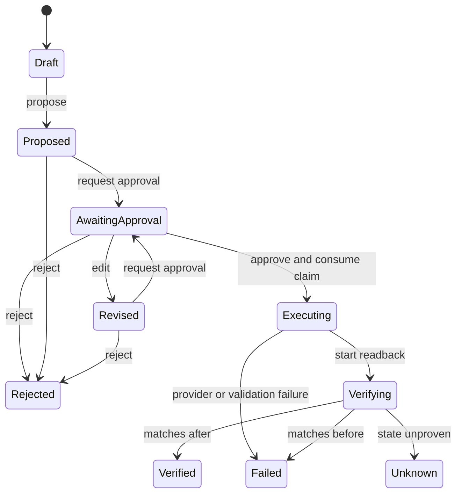

# Proposal Review Across Graph and Surfaces

A requested paid-media mutation is not a direct provider call. It becomes a persisted, typed proposal bound to its requester and graph thread; execution is a separate, interrupted step. The graph and domain services enforce the write protocol, while a surface is responsible for presenting the review and resuming the appropriate run. Caller identity, thread ownership, and the decision to create an approval claim are **host-owned**: a model argument, Slack button value, or other client payload is not authority.

## The two review surfaces

The deployed Managed Deep Agents (MDA) channel is defined in `channels/slack.py`. It provides Slack mentions, direct messages, threads, and MDA's native approve/reject card for `execute_change`. The card itself is rendered by MDA and cannot currently be customized; the agent is therefore expected to write its proposal summary immediately before calling `execute_change`. [Surface architecture](repo://docs/architecture/surfaces-and-presentation.md#L9-L20) · [channel definition](repo://channels/slack.py#L1-L8)

The retained custom Slack implementation is a transport-neutral application service, not a second set of write powers. It uses the same `AgentRunner`, `ProposalService`, receipt store, and graph; a transport supplies event delivery and posts its replies. Its Block Kit proposal card can show Approve, Edit, and Reject, whereas the native MDA card is approve/reject only. [shared runner boundary](repo://src/paid_media_agent/surfaces/runner.py#L53-L67) · [custom Slack scope](repo://src/paid_media_agent/surfaces/slack/service.py#L1-L5) · [custom actions](repo://src/paid_media_agent/surfaces/slack/blocks.py#L98-L145)

## End-to-end control flow

This shows the common protocol: presentation and event handling vary by surface, but proposal persistence and executor checks remain the authority.

### 1. Stage a reviewable proposal

`propose_change` accepts an account alias, admitted mutation name, target, allowed field changes, and reviewer-facing reason/plans. `ProposalService.propose` resolves the current authorized mutation and reviewed write-policy entry, maps the host-owned alias to a provider account, validates the canonical arguments against the provider schema, and reads the target's current state. It persists the resulting `ChangeSet` in `awaiting_approval`, including before/after values, catalog revision, schema and policy digests, derived risk flags, requester reference, thread ID, and an opaque routing ID. It does not execute the provider mutation. [tool contract](repo://src/paid_media_agent/tools/write_tools.py#L30-L54) · [proposal validation and state capture](repo://src/paid_media_agent/tools/writes.py#L325-L447) · [changeset fields and digest material](repo://src/paid_media_agent/domain/proposals.py#L85-L145)

Only mutations both present in the authorized catalog and covered by the write policy can be proposed; unknown tools, non-mutations, unknown or cross-platform aliases, noneditable fields, invalid targets, schema failures, and unreadable targets are denied. Account aliases deliberately keep provider IDs host-side. [admission and account/schema checks](repo://src/paid_media_agent/tools/writes.py#L325-L386) · [host-owned alias mapping](repo://src/paid_media_agent/config.py#L52-L81)

### 2. Interrupt the graph without losing the proposal

The agent definition gives MDA the shared tools and the `interrupt_on` configuration. The interrupt predicate only pauses an `execute_change` call whose proposal ID belongs to the current graph thread; it permits only `approve` and `reject` decisions. The proposal remains persisted in `awaiting_approval`, and the runner retrieves the graph snapshot to report the interruption while preserving the last assistant prose plus a review prompt. [MDA assembly](repo://agent.py#L1-L21) · [thread-bound interrupt configuration](repo://src/paid_media_agent/tools/write_tools.py#L86-L118) · [interrupted runner outcome](repo://src/paid_media_agent/surfaces/runner.py#L74-L99)

For an MDA-native card, on resume `execute_change` derives the acting identity from host runtime configuration in priority order: `caller_ref`, MDA user header, then LangGraph authentication identity (with a local fallback). If no surface already created a claim, it creates one only when the persisted proposal still belongs to that thread and its current revision equals the revision frozen in the interrupted tool call. It then delegates to the executor. Thus a changed proposal cannot be executed through a card that displayed an older revision. [identity resolution](repo://src/paid_media_agent/tools/write_tools.py#L57-L71) · [resume-time revision and claim handling](repo://src/paid_media_agent/tools/write_tools.py#L155-L189)

### 3. Review with the retained custom Slack service

A custom Slack transport calls `handle_event` for app mentions and DMs. The service drops duplicate event IDs, ignores bot/subtype events and non-DM ordinary messages, derives an opaque stable graph thread ID from team/channel/conversation timestamp, and maps the Slack user through an optional host `approver_lookup` before falling back to a namespaced Slack reference. It passes that caller reference to the runner; the thread ownership store binds a thread to its first caller and refuses later callers. [event filtering and caller/thread derivation](repo://src/paid_media_agent/surfaces/slack/service.py#L35-L117) · [thread ownership contract](repo://src/paid_media_agent/persistence/interfaces.py#L43-L48) · [runner enforcement](repo://src/paid_media_agent/surfaces/runner.py#L69-L72)

A Block Kit button carries only the persisted proposal's opaque routing ID. On an action, the service deduplicates the action, reloads the proposal by that ID, obtains the actor reference through its host mapping, and calls the runner. It never trusts a client-supplied mutation payload or proposal details. Approve creates the approval claim first and then resumes the proposal requester's graph thread; reject persists rejection first and resumes with a reject decision. A missing routing ID receives a stale-review response. [action rehydration and dispatch](repo://src/paid_media_agent/surfaces/slack/service.py#L130-L183) · [runner approval/rejection order](repo://src/paid_media_agent/surfaces/runner.py#L129-L151)

Edit is available only while awaiting approval. The custom card instructs the reviewer to reply `edit <field> <value>`; the service locates the latest proposal in that conversation, parses the value, and requests a revision. Revision revalidates the permitted fields, increments the revision, recomputes the digest and risk flags, restores `awaiting_approval`, and issues a new routing ID. Earlier claims are revision-bound and cannot authorize the revised proposal. [edit interaction](repo://src/paid_media_agent/surfaces/slack/service.py#L95-L109) · [edit handling](repo://src/paid_media_agent/surfaces/slack/service.py#L185-L203) · [revision lifecycle](repo://src/paid_media_agent/tools/writes.py#L456-L495) · [claim revision check](repo://src/paid_media_agent/tools/writes.py#L612-L628)

## Approval is a host-issued, bounded capability

`ProposalService.approve` is the sole claim-creation path. It requires `awaiting_approval`, applies the configured allowlist and self-approval rule to the host-established `approver_ref`, verifies the persisted proposal digest, and saves an HMAC-signed claim bound to proposal ID, revision, digest, account, tool, requester, approver, nonce, and expiration. The signing key stays in the host. Approver IDs, TTL, self-approval policy, and signing key come from settings; an absent key yields an ephemeral signer for the profile rather than a client-held secret. [approval policy and signer](repo://src/paid_media_agent/tools/writes.py#L128-L160) · [claim creation](repo://src/paid_media_agent/tools/writes.py#L512-L549) · [claim binding](repo://src/paid_media_agent/domain/proposals.py#L148-L181) · [settings-to-policy setup](repo://src/paid_media_agent/runtime/profiles.py#L103-L119)

This is the proposal state machine; rejection and revision return control to review rather than authorizing a mutation. [transition table](repo://src/paid_media_agent/domain/proposals.py#L19-L74)

## Execution and receipts

Before any provider call, `WriteExecutor` checks that the proposal is still awaiting approval; finds an unused claim for its exact revision; verifies signature, digest, account/tool/requester scope, and expiry; revalidates the current catalog, schema, write policy, readback authorization, and account binding; and applies the write gate. Claim consumption is atomic at the repository boundary: a failed `mark_used` means replay is refused. These checks make the executor—not the surface, graph decision, or client payload—the final authority. [executor preconditions](repo://src/paid_media_agent/tools/writes.py#L753-L788) · [claim and catalog verification](repo://src/paid_media_agent/tools/writes.py#L612-L661) · [single-use repository contract](repo://src/paid_media_agent/persistence/interfaces.py#L21-L28)

The live gate refuses a kill switch, disabled writes, an unpinned or changed reviewed catalog revision, or a tool outside the released canary list. Fake providers bypass only the live-release conditions, not the kill switch. Configuration defaults writes to disabled and defines the kill-switch, pinned revision, canary tools, approvers, and TTL. [gate ordering](repo://src/paid_media_agent/tools/writes.py#L169-L226) · [configuration](repo://src/paid_media_agent/config.py#L143-L153) · [runtime wiring](repo://src/paid_media_agent/runtime/profiles.py#L60-L72)

After consuming the claim, the executor makes one mutation attempt (optionally a validate-only call first), attaches a proposal/revision idempotency value when the policy supports it, and does not retry a timeout. It performs bounded readback: matching the after values yields `verified`; remaining at before values yields `failed`; otherwise the outcome is `unknown`. Each path saves a receipt recording attempted/acknowledged flags, provider operation reference, observed state, catalog revision, reason, and number of readback attempts. [mutation, timeout, and readback outcomes](repo://src/paid_media_agent/tools/writes.py#L789-L892) · [receipt model](repo://src/paid_media_agent/domain/proposals.py#L184-L210)

The runner obtains the receipt by proposal ID for outcomes and explicit lookup. The custom Slack renderer selects a receipt only after a terminal proposal state and matching revision; it presents verified, rejected, failed, or unknown status. Unknown includes an explicit instruction not to retry blindly, but to reconcile read-only or open a new proposal. Proposal and receipt rendering use structured presentation views, accessible top-level text, bounded escaped model prose, and opaque IDs rather than model text for action routing. [runner receipt lookup](repo://src/paid_media_agent/surfaces/runner.py#L78-L99) · [outcome selection](repo://src/paid_media_agent/surfaces/slack/service.py#L119-L128) · [receipt and rendering safeguards](repo://src/paid_media_agent/surfaces/slack/blocks.py#L1-L74) · [unknown receipt guidance](repo://src/paid_media_agent/surfaces/slack/blocks.py#L148-L171)

## Persistence and restart considerations

The interfaces require proposal lookup by proposal ID, routing ID, and thread; approval lookup/one-time consumption; receipt lookup; and thread ownership. The bundled profile uses in-memory implementations for fixtures and local demo, explicitly not a production persistence profile. A durable deployment must provide repositories with equivalent semantics—particularly durable proposals/claims/receipts, atomic single-use claim consumption, and thread ownership—alongside the graph checkpointer that MDA owns. [repository interfaces](repo://src/paid_media_agent/persistence/interfaces.py#L11-L48) · [in-memory limitation](repo://src/paid_media_agent/persistence/memory.py#L1-L9) · [MDA ownership boundary](repo://src/paid_media_agent/runtime/mda.py#L1-L6)

The graph can resume after a restart when the same checkpointer and persisted repositories are supplied: the contract test constructs a new graph over the original checkpoint/repositories, observes the outstanding interrupt, approves, resumes, and verifies exactly one mutation. [restart contract](repo://tests/contract/test_write_flows_graph.py#L310-L358)

## Focused verification

The graph contract suite proves that `execute_change` interrupts before any mutation; that approved execution verifies the changed state; and that non-approvers, self-approval, altered persisted payloads, stale catalog/schema, expired claims, revisions, and replayed claims cannot cause a mutation. It also covers timeout-after-commit reconciliation, timeout without commit, provider errors, and unprovable bounded readback. [approval and tampering cases](repo://tests/contract/test_write_flows_graph.py#L45-L187) · [catalog and result cases](repo://tests/contract/test_write_flows_graph.py#L235-L307)

The surface contract exercises the custom Slack path end to end: duplicate events are dropped, the routed proposal retains the requester's identity, a requester cannot self-approve, an authorized reviewer button resumes the same graph and produces a verified receipt, and the requester retains thread ownership. [Slack parity contract](repo://tests/contract/test_surfaces_and_runtimes.py#L35-L107)
